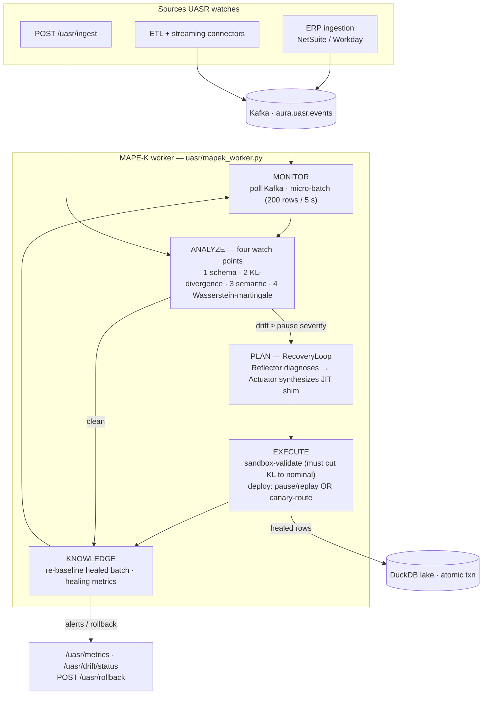
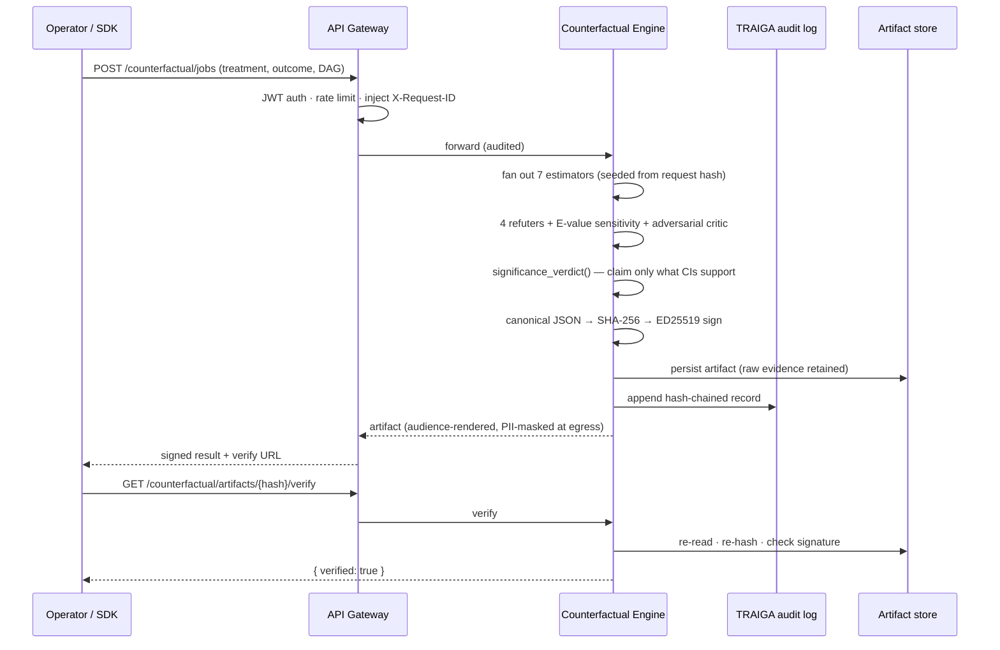

# AURA System Architecture

The canonical topology reference. For the product narrative see [README.md](./README.md); for deployment and compliance see [ENTERPRISE.md](./ENTERPRISE.md); for the sprint history see [docs/SPRINTS.md](./docs/SPRINTS.md).

AURA is **thirteen FastAPI microservices** organized into three planes, every one instantiated through a single `create_service()` chassis so they share identical auth, rate-limiting, security-header, telemetry, and error-handling behavior. The frontend talks only to the API Gateway.

---

## Service topology

```mermaid
flowchart TB
    USER["Browser · Python SDK · CLI · curl"]
    FE["Frontend — React 19 + Vite · :5173"]
    GW["API Gateway · :8000<br/>JWT auth · rate limit · SSE · TRAIGA audit middleware · request-ID"]

    USER --> FE --> GW

    subgraph P1["Conversational analytics plane"]
        CG["Code-Gen · :8001<br/>NL→SQL + DPC cross-check"]
        ORCH["Orchestration · :8006<br/>generator / critic, parallel-wave executor"]
        INS["Insights · :8005"]
        SBX["Execution Sandbox · :8003<br/>isolated compute"]
        CONN["Connectors · :8002<br/>PG · MySQL · BQ · DuckDB · FAISS · spatial · Vault"]
        MET["Metadata Store · :8007"]
        SCH["Scheduler · :8004<br/>distributed queue · LISTEN/NOTIFY · advisory locks"]
    end

    subgraph P2["Causal + financial audit plane"]
        CF["Counterfactual Audit Engine · :8012<br/>7 estimators × 4 refuters × critic<br/>ED25519 · conformal CI · E-value"]
        CAUS["Causal Service · :8010<br/>DoWhy GCM root-cause"]
        DAR["DAR · :8011<br/>autonomous research daemon"]
        HITL["HITL Exception Queue<br/>signed overrides · WORM log"]
        CF --- HITL
    end

    subgraph P3["Streaming + self-healing plane"]
        ING["Ingestion Gateway<br/>ERP adapters · fail-closed auth · PII perimeter"]
        KAF[("Kafka<br/>idempotent producer + DLQ")]
        UASR["UASR · :8009<br/>MAPE-K self-healing worker"]
        LAKE[("DuckDB analytics lake<br/>atomic Parquet loads")]
        ING --> KAF --> UASR --> LAKE
    end

    GW --> CG & ORCH & INS & SBX & CONN & MET & SCH & CF & ING
    CF --- CAUS & DAR
    CONN -.-> LAKE
```

### Port map

| Port | Service | Module | Role |
|------|---------|--------|------|
| 8000 | API Gateway | `api_gateway.main:app` | Single front door — auth, rate limit, routing, SSE relay, audit middleware |
| 8001 | Code Generation | `code_generation_service.main:code_gen_app` | NL→SQL generation + DPC dual-paradigm cross-check |
| 8002 | Connectors / Vault | `connectors.main:app` | PostgreSQL, MySQL, BigQuery, DuckDB, FAISS vector, spatial; secret storage |
| 8003 | Execution Sandbox | `execution_sandbox_service.main:execution_app` | Isolated code/query execution — sandbox failure can't crash the gateway |
| 8004 | Scheduler | `scheduler_service.main:scheduler_app` | Distributed job queue, cron/interval/DAG jobs, Postgres `LISTEN/NOTIFY` |
| 8005 | Insights | `insights.main:app` | Analytics + insight surfaces |
| 8006 | Orchestration | `orchestration_service.main:app` | Generator/critic loop, parallel-wave task executor |
| 8007 | Metadata Store | `metadata_store.main:metadata_app` | Central metadata, schema sidecar cache |
| 8009 | UASR | `uasr.service:app` | Self-healing MAPE-K layer (HTTP API + opt-in Kafka worker) |
| 8010 | Causal Service | `causal_service.main:app` | DoWhy GCM root-cause attribution |
| 8011 | DAR | `dar_service.main:app` | Data-Agnostic Researcher autonomous insight daemon |
| 8012 | Counterfactual Audit Engine | `counterfactual_service.main:app` | Signed causal + financial audit core |
| —    | Ingestion Gateway | `ingestion_service.main:app` | Headless ERP ingestion (NetSuite/Workday); launched per-deployment |

> Port 8008 is intentionally unallocated. The Ingestion Gateway is a `create_service()` app launched at deploy time (compose/Helm overlay), not pinned in the base port range.

---

## The three planes

### 1 · Conversational analytics plane
The operator-facing path. A natural-language question enters the Gateway, the **Orchestration** service resolves it into a dependency graph of agent tasks and runs them in parallel "waves" (`_resolve_execution_order`, Kahn's algorithm + bounded `asyncio.Semaphore`), **Code-Gen** turns intent into SQL, **Connectors** executes against the right backend (relational, vector, or spatial), and heavy work is offloaded to the **Execution Sandbox** so a runaway query can't freeze the gateway or block other tenants. Long-running jobs go through the **Scheduler** and stream state back over SSE.

Every generated SQL query is independently re-solved by an AST-sandboxed pandas program (**DPC** — Dual-Paradigm Cross-check) and the two results compared: `verified` / `mismatch` / `skipped`, with bounded retry. Two paradigms agreeing is verification; an LLM agreeing with itself is not.

### 2 · Causal + financial audit plane
The differentiator. The **Counterfactual Audit Engine** answers "what-if" questions with up to seven estimators (OLS, IPW, PSM, LinearDR, ForestDR, TMLE, IV-2SLS), four refuters, an E-value + Cinelli-Hazlett sensitivity report on every estimate, and an adversarial LLM critic. The result is sealed as one canonical JSON artifact → SHA-256 → ED25519 signature → disk + audit log, replayable byte-for-byte. The **Causal Service** (DoWhy GCM) and **DAR** daemon feed this plane. The **financial-audit** vertical layers PCAOB standards (AS-1215/2110/2201/2305/2401) on the same signing core, with a human-in-the-loop **exception queue** whose override decisions are signed and WORM-logged.

### 3 · Streaming + self-healing plane
The reliability story. The **Ingestion Gateway** accepts ERP data (fail-closed JWT auth, PII masked at the perimeter), publishes to **Kafka** (idempotent producer, DLQ on failure), and **UASR** consumes from Kafka, runs each batch through its MAPE-K loop, and only then lands healed rows in the **DuckDB lake** via atomic Parquet transactions. This is where fragile pipelines are made self-healing — detailed below.

---

## UASR — where self-healing happens

UASR sits **between the Kafka spine and the analytics lake**. Every micro-batch passes through a MAPE-K (Monitor–Analyze–Plan–Execute–Knowledge) loop; nothing reaches the lake unexamined, and nothing drifted reaches it unhealed.

### The four watch points (`uasr/drift_detector.py`)

Each batch is compared against a per-source baseline registered via `POST /uasr/baseline`:

| # | Watch point | Catches | Mechanism |
|---|-------------|---------|-----------|
| 1 | Schema drift | column add/remove/type-change | set-diff + dtype compare; removals raise severity, losing >50% of columns is CRITICAL |
| 2 | Statistical drift | distribution shift | per-column KL-divergence vs. **adaptive** ζ = mean + 2σ of KL history, plus a >2σ location-shift guard so range explosions can't hide |
| 3 | Semantic drift | "same schema, new meaning" | cosine distance between a feature-hashed batch embedding and the source's reference context matrix |
| 4 | Wasserstein martingale *(opt-in)* | slow creep below KL's radar | exchangeability martingale on W₁ with an **Azuma-Hoeffding false-alarm bound ≤ α**; fails open to 1–3 |

### The healing path (`uasr/recovery_loop.py`)

When drift crosses the pause threshold, the batch is **not** dropped and Kafka offsets are **not** lost:

1. **Pause** — consumer polling gates on an `asyncio.Event`; the consumer stays alive, offsets preserved.
2. **Diagnose** — `DiagnosticReflectorAgent` reasons over the drift vector to a root cause.
3. **Synthesize** — `SynthesisActuatorAgent` writes a just-in-time transformation shim.
4. **Validate** — the shim runs in a sandbox; it deploys only if it cuts DKL back to nominal. With the opt-in causal-RL evaluator, candidates compete on counterfactual expected improvement instead of greedy first-pass.
5. **Deploy** — either *pause → apply → replay → resume*, or the **canary ShimRouter** which keeps ingestion running and ramps the shim's traffic share based on drift re-detection.
6. **Learn** — the healed batch becomes the new baseline; the event lands in `/uasr/metrics`; the shim is reversible via `POST /uasr/rollback`.

If recovery fails validation the consumer **stays paused** — fail-closed, no corrupted data reaches the lake — and the failure surfaces as an alert.

---

## Request lifecycle (signed causal audit)

---

## Cross-cutting infrastructure

- **Service Factory** (`shared/service_factory.py`) — every service inherits sliding-window IP rate limiting, JWT bearer auth, security headers, Prometheus hooks, request-ID middleware, and exception→JSON handling. Per-service security review is unnecessary by construction.
- **TRAIGA audit log** (`shared/audit_log.py`) — append-only, hash-chained, with an RFC 6962 Merkle tree, signed tree heads, and inclusion proofs for third-party verification (S19).
- **Signing** (`shared/`) — persistent ED25519 keys with admin-gated revocation; signing refuses revoked key IDs; sign and verify share one payload helper so they cannot drift.
- **PII masking** (`shared/pii_masking.py`) — HMAC-keyed deterministic tokenization at egress; without `AURA_PII_TOKEN_KEY`, fail-safe to `[REDACTED]` (never an invertible unkeyed hash). The ingestion perimeter uses a pure-ASGI middleware (a `BaseHTTPMiddleware` body rewrite is silently a no-op — see S35 notes).
- **Persistence** (`api_gateway/persistence.py`) — lazy-init via `session_scope()` so a router imported without the lifespan still gets working tables.
- **Streaming** (`shared/streaming_manager.py`) — in-process pub/sub bus behind the SSE endpoint.
- **SDK codegen** (`sdk_clients/`) — 11 typed clients, regenerated from each service's OpenAPI schema and held byte-stable by the CI codegen-sync gate.

---

## Production gates

With `ENVIRONMENT=production`, boot **fails** on any of: open auth mode, default `SECRET_KEY`, or wildcard/`http://` CORS. The Helm chart pins `ENVIRONMENT=production` and `AURA_AUTH_MODE=password`. Full checklist in [ENTERPRISE.md](./ENTERPRISE.md).

---

## Technology stack

| Layer | Stack |
|-------|-------|
| Frontend | React 19 · TypeScript 5.9 · Vite · design-system CSS variables · Vitest |
| Backend | Python 3.11/3.12 · FastAPI · Uvicorn · SQLAlchemy (async) · Pydantic v2 |
| Causal | DoWhy · EconML · statsmodels · NumPy / scikit-learn |
| Streaming | aiokafka · DuckDB · PyArrow (Parquet) |
| Crypto | ED25519 (PyNaCl/cryptography) · HMAC-SHA256 · canonical JSON (RFC 8785) |
| Deploy | Docker · Docker Compose · Helm · GHCR · GitHub Actions (14-job CI) |

---

**Last updated:** 2026-06-13 · supersedes the pre-pivot (Jan 2026) topology doc.
