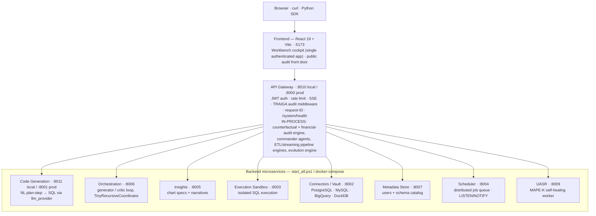
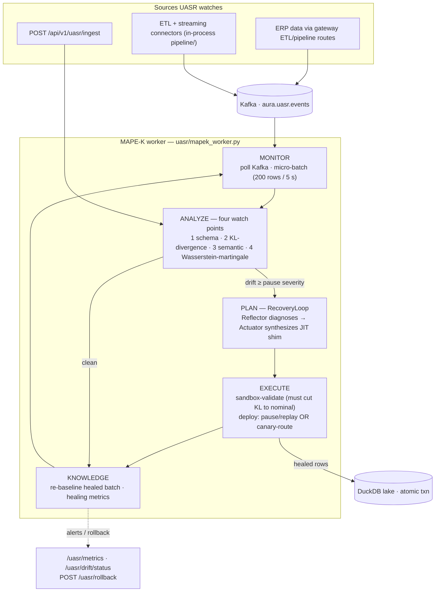
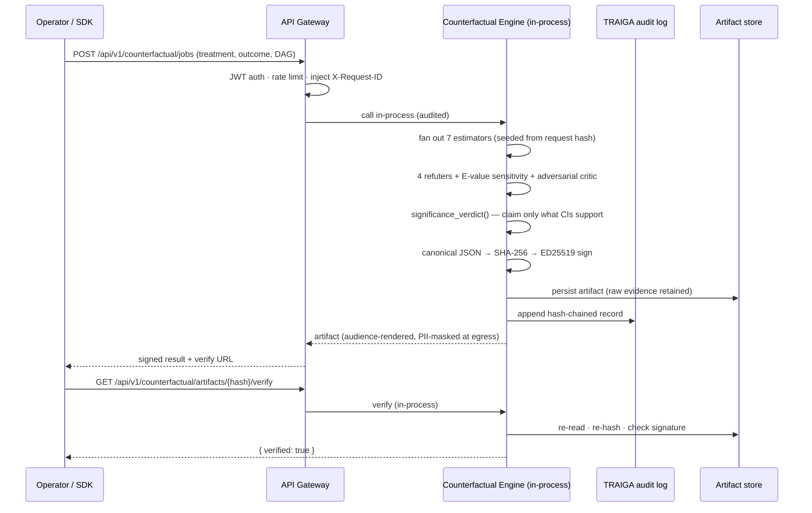

# AURA System Architecture

**Last updated: 2026-07-28.** This revision reconciles the doc with the
post-pivot topology; it supersedes the 2026-06-13 revision, which described a
pre-pivot 13-service/3-plane shape that no longer matches the running system.

For the product narrative see [README.md](./README.md); for deployment and
compliance see [ENTERPRISE.md](./ENTERPRISE.md); for the sprint history see
[docs/SPRINTS.md](./docs/SPRINTS.md). **`README.md` and `docs/CODEMAPS/`
(especially `architecture.md` and `backend.md`) are the living, generated
source of truth for service topology, ports, and routes** — this document
goes deeper on the parts of the system that don't change every sprint: the
causal/financial audit engine's internals, the TRAIGA audit chain, and the
UASR self-healing math. If this file and the codemaps ever disagree on a
port or a service list, trust the codemaps.

AURA runs as **nine FastAPI/uvicorn processes**, every one instantiated
through a single `create_service()` chassis so they share identical auth,
rate-limiting, security-header, telemetry, and error-handling behavior. The
frontend talks only to the API Gateway. Several capabilities that earlier
revisions of this document described as *separate services* — the
counterfactual/financial-audit engine, the causal-discovery service, and the
autonomous-research daemon — now run **in-process inside the gateway**, or
(for the latter two) are orphaned code paths not wired into the live stack
at all. See "What changed since the 13-service design" below.

---

## Service topology

```mermaid
flowchart TB
    USER["Browser · curl · Python SDK"]
    FE["Frontend — React 19 + Vite · :5173<br/>Workbench cockpit (single authenticated app) · public audit front door"]
    GW["API Gateway · :8010 local / :8000 prod<br/>JWT auth · rate limit · SSE · TRAIGA audit middleware · request-ID · /system/health<br/>IN-PROCESS: counterfactual + financial-audit engine,<br/>commander agents, ETL/streaming pipeline engines, evolution engine"]

    USER --> FE --> GW

    subgraph SVCS["Backend microservices — start_all.ps1 / docker-compose"]
        CG["Code Generation · :8011 local / :8001 prod<br/>NL plan-step → SQL via llm_provider"]
        ORCH["Orchestration · :8006<br/>generator / critic loop, TinyRecursiveCoordinator"]
        INS["Insights · :8005<br/>chart specs + narratives"]
        SBX["Execution Sandbox · :8003<br/>isolated SQL execution"]
        CONN["Connectors / Vault · :8002<br/>PostgreSQL · MySQL · BigQuery · DuckDB"]
        MET["Metadata Store · :8007<br/>users + schema catalog"]
        SCH["Scheduler · :8004<br/>distributed job queue · LISTEN/NOTIFY"]
        UASR["UASR · :8009<br/>MAPE-K self-healing worker"]
    end

    GW --> CG & ORCH & INS & SBX & CONN & MET & SCH & UASR
```

### Port map

| Port (local / prod) | Service | Module | Role |
|------|---------|--------|------|
| 8010 / 8000 | API Gateway | `api_gateway.main:app` | Single front door — auth, rate limit, routing, SSE relay, `/system/health` aggregation. Runs the counterfactual/financial-audit engine and commander agents in-process. |
| 8011 / 8001 | Code Generation | `code_generation_service.main:code_gen_app` | Turns a plan step into SQL via `shared/llm_provider`; fails loud (503/502) with no LLM configured. |
| 8002 | Connectors / Vault | `connectors.main:app` | PostgreSQL, MySQL, BigQuery, DuckDB connections + connector registry; reported as `database_service` in health. |
| 8003 | Execution Sandbox | `execution_sandbox_service.main:execution_app` | Isolated SQL/code execution — a sandbox failure can't crash the gateway. |
| 8004 | Scheduler | `scheduler_service.main:scheduler_app` | Distributed job queue, cron/interval schedules, Postgres `LISTEN/NOTIFY`. |
| 8005 | Insights | `insights_service.main:app` | Auto-generated insights, chart specs, narratives. |
| 8006 | Orchestration | `orchestration_service.main:app` | Generator/critic agent loop, parallel-wave task executor. Not polled by `/system/health`. |
| 8007 | Metadata Store | `metadata_store.main:metadata_app` | Users table (auth backing store), schema registry/catalog. |
| 8009 | UASR | `uasr.service:app` | Self-healing MAPE-K layer (HTTP API + opt-in Kafka worker). |

Local ports 8010/8011 (instead of the default 8000/8001) are a **this-machine
convention** — `aurabackend/start_all.ps1` moves the Gateway and Code-Gen off
8000/8001 because a local `claude-science` daemon squats those ports; both
docker-compose files and the Helm chart still default the gateway to `:8000`
and code-gen to `:8001`. The frontend's CSP `connect-src` allows both
`:8000` and `:8010` so either setup works. `GET /system/health` on the
gateway polls seven of the eight backend services above (all except
Orchestration) plus itself, so a fully-up stack reports **8 healthy
services**.

### Frontend topology

The classic `/app` shell (`App.tsx`) has been **deleted**. `/workbench` is
now the single authenticated cockpit; `frontend/src/AppRoutes.tsx` redirects
`/app/*` to `/workbench` behind `ProtectedRoute`. A second authenticated
surface, the **Terminal** cockpit (`/app/terminal`, a `dockview-react` panel
grid with the Constellation lineage graph), also runs behind
`ProtectedRoute`. Public, unauthenticated routes — `/`, `/login`, `/signup`,
`/audit/*`, `/certificate/:hash`, `/verify/:hash` — let anyone verify a
signed audit certificate by its hash without logging in.

### What changed since the 13-service design

- **Counterfactual Audit Engine** — previously documented as its own
  service on `:8012`. It is now mounted **in-process** in the gateway via
  `api_gateway/routers/counterfactual.py` (module `counterfactual_service`,
  imported as a library). The engine's internals below are unchanged; only
  the deployment shape moved.
- **Causal Service** (`causal_service/`, DoWhy GCM root-cause) and **DAR**
  (`dar_service/`, autonomous research daemon) — the code still exists on
  disk with its own tests, and `deploy/helm/aura/values.yaml` still
  configures both as separately deployable pods on `:8010`/`:8011`. Neither
  is wired into `api_gateway`, neither appears in `docker-compose.yml` or
  `docker-compose.prod.yml`, and neither is launched by `start_all.ps1`. In
  the topology actually running today (local dev and both docker-compose
  stacks) they are **orphaned** — worth a deliberate decision (retire, or
  reconnect) rather than treating the Helm chart's inclusion of them as
  current architecture.
- **Ingestion Gateway** — earlier revisions described a standalone,
  fail-closed ERP ingestion service. `ingestion_service/` exists on disk but
  is not referenced by the gateway, `docker-compose*.yml`, or the Helm
  chart. ERP/streaming data enters the live system through ordinary gateway
  routes instead — `POST /api/v1/etl/*`, `/api/v1/pipeline/*`,
  `/api/v1/streaming/*` (in-process pipeline engines), and
  `POST /api/v1/uasr/ingest` direct to the UASR watch points.

---

## Capability areas

The three "planes" from the pre-pivot design map onto capability areas
inside the same nine-process topology rather than dedicated services.

### Conversational analytics

A natural-language question enters the Gateway; **Orchestration** (`:8006`)
resolves it into a dependency graph of agent tasks and runs them in parallel
"waves" (`_resolve_execution_order`, Kahn's algorithm + bounded
`asyncio.Semaphore`), **Code-Gen** (`:8011`/`:8001`) turns intent into SQL,
**Connectors** (`:8002`) executes against the right backend, and heavy work
is offloaded to the **Execution Sandbox** (`:8003`) so a runaway query can't
freeze the gateway or block other tenants. Long-running jobs go through the
**Scheduler** (`:8004`) and stream state back over SSE.

Every generated SQL query is independently re-solved by an AST-sandboxed
pandas program (**DPC** — Dual-Paradigm Cross-check) and the two results
compared: `verified` / `mismatch` / `skipped`, with bounded retry. Two
paradigms agreeing is verification; an LLM agreeing with itself is not.

### Causal + financial audit engine (in-process)

The differentiator, and the one piece of the pre-pivot "plane 2" that is
still fully live — just running inside the gateway process instead of on
its own port. The **Counterfactual Audit Engine** answers "what-if"
questions with up to seven estimators (OLS, IPW, PSM, LinearDR, ForestDR,
TMLE, IV-2SLS), four refuters, an E-value + Cinelli-Hazlett sensitivity
report on every estimate, and an adversarial LLM critic. The result is
sealed as one canonical JSON artifact → SHA-256 → ED25519 signature → disk +
audit log, replayable byte-for-byte. The **financial-audit** vertical layers
PCAOB standards (AS-1215/2110/2201/2305/2401) on the same signing core, with
a human-in-the-loop **exception queue** whose override decisions are signed
and WORM-logged. (The DoWhy-GCM **Causal Service** and the **DAR** daemon
that fed this plane in the pre-pivot design are the orphaned services noted
above — not currently in the request path.)

### Streaming + self-healing (UASR)

The reliability story. ERP/streaming data lands via the gateway's ETL,
pipeline, and `uasr/ingest` routes, optionally publishes to **Kafka**
(idempotent producer, DLQ on failure), and **UASR** (`:8009`) consumes,
runs each batch through its MAPE-K loop, and only then lands healed rows in
the **DuckDB lake** via atomic Parquet transactions. This is where fragile
pipelines are made self-healing — detailed below.

---

## UASR — where self-healing happens

UASR sits **between the Kafka spine and the analytics lake**. Every micro-batch passes through a MAPE-K (Monitor–Analyze–Plan–Execute–Knowledge) loop; nothing reaches the lake unexamined, and nothing drifted reaches it unhealed.

```mermaid
flowchart TB
    subgraph SRC["Sources UASR watches"]
        ERP["ERP data via gateway ETL/pipeline routes"]
        ETL["ETL + streaming connectors (in-process pipeline/)"]
        DIRECT["POST /api/v1/uasr/ingest"]
    end
    KAFKA[("Kafka · aura.uasr.events")]
    ERP --> KAFKA
    ETL --> KAFKA

    subgraph LOOP["MAPE-K worker — uasr/mapek_worker.py"]
        MON["MONITOR<br/>poll Kafka · micro-batch (200 rows / 5 s)"]
        ANA["ANALYZE — four watch points<br/>1 schema · 2 KL-divergence · 3 semantic · 4 Wasserstein-martingale"]
        PLAN["PLAN — RecoveryLoop<br/>Reflector diagnoses → Actuator synthesizes JIT shim"]
        EXE["EXECUTE<br/>sandbox-validate (must cut KL to nominal)<br/>deploy: pause/replay OR canary-route"]
        KNO["KNOWLEDGE<br/>re-baseline healed batch · healing metrics"]
        MON --> ANA
        ANA -- "drift ≥ pause severity" --> PLAN --> EXE --> KNO
        ANA -- "clean" --> KNO
        KNO --> MON
    end
    KAFKA --> MON
    DIRECT --> ANA

    LAKE[("DuckDB lake · atomic txn")]
    EXE -- "healed rows" --> LAKE
    KNO -. "alerts / rollback" .-> OPS["/uasr/metrics · /uasr/drift/status<br/>POST /uasr/rollback"]
```

### The four watch points (`uasr/drift_detector.py`)

Each batch is compared against a per-source baseline registered via `POST /uasr/baseline`:

| # | Watch point | Catches | Mechanism |
|---|-------------|---------|-----------|
| 1 | Schema drift | column add/remove/type-change | set-diff + dtype compare; removals raise severity, losing >50% of columns is CRITICAL |
| 2 | Statistical drift | distribution shift | per-column KL-divergence vs. **adaptive** ζ = mean + 2σ of KL history, plus a >2σ location-shift guard so range explosions can't hide |
| 3 | Semantic drift | "same schema, new meaning" | cosine distance between a feature-hashed batch embedding and the source's reference context matrix |
| 4 | Wasserstein martingale *(opt-in)* | slow creep below KL's radar | exchangeability martingale on W₁ with an **Azuma-Hoeffding false-alarm bound ≤ α**; fails open to 1–3 |

### The healing path (`uasr/recovery_loop.py`)

When drift crosses the pause threshold, the batch is **not** dropped and Kafka offsets are **not** lost:

1. **Pause** — consumer polling gates on an `asyncio.Event`; the consumer stays alive, offsets preserved.
2. **Diagnose** — `DiagnosticReflectorAgent` reasons over the drift vector to a root cause.
3. **Synthesize** — `SynthesisActuatorAgent` writes a just-in-time transformation shim.
4. **Validate** — the shim runs in a sandbox; it deploys only if it cuts DKL back to nominal. With the opt-in causal-RL evaluator, candidates compete on counterfactual expected improvement instead of greedy first-pass.
5. **Deploy** — either *pause → apply → replay → resume*, or the **canary ShimRouter** which keeps ingestion running and ramps the shim's traffic share based on drift re-detection.
6. **Learn** — the healed batch becomes the new baseline; the event lands in `/uasr/metrics`; the shim is reversible via `POST /uasr/rollback`.

If recovery fails validation the consumer **stays paused** — fail-closed, no corrupted data reaches the lake — and the failure surfaces as an alert.

---

## Request lifecycle (signed causal audit)

The counterfactual engine runs **in-process** in the gateway; the `GW → CF`
hop below is a Python call, not a network request, but the audit trail it
produces is identical either way.

```mermaid
sequenceDiagram
    participant U as Operator / SDK
    participant GW as API Gateway
    participant CF as Counterfactual Engine (in-process)
    participant AL as TRAIGA audit log
    participant FS as Artifact store

    U->>GW: POST /api/v1/counterfactual/jobs (treatment, outcome, DAG)
    GW->>GW: JWT auth · rate limit · inject X-Request-ID
    GW->>CF: call in-process (audited)
    CF->>CF: fan out 7 estimators (seeded from request hash)
    CF->>CF: 4 refuters + E-value sensitivity + adversarial critic
    CF->>CF: significance_verdict() — claim only what CIs support
    CF->>CF: canonical JSON → SHA-256 → ED25519 sign
    CF->>FS: persist artifact (raw evidence retained)
    CF->>AL: append hash-chained record
    CF-->>GW: artifact (audience-rendered, PII-masked at egress)
    GW-->>U: signed result + verify URL
    U->>GW: GET /api/v1/counterfactual/artifacts/{hash}/verify
    GW->>CF: verify (in-process)
    CF->>FS: re-read · re-hash · check signature
    CF-->>U: { verified: true }
```

---

## Cross-cutting infrastructure

- **Service Factory** (`shared/service_factory.py`) — every service inherits sliding-window IP rate limiting, JWT bearer auth, security headers, Prometheus hooks, request-ID middleware, and exception→JSON handling. Per-service security review is unnecessary by construction.
- **TRAIGA audit log** (`shared/audit_log.py`) — append-only, hash-chained, with an RFC 6962 Merkle tree, signed tree heads, and inclusion proofs for third-party verification (S19).
- **Signing** (`shared/`) — persistent ED25519 keys with admin-gated revocation; signing refuses revoked key IDs; sign and verify share one payload helper so they cannot drift.
- **PII masking** (`shared/pii_masking.py`) — HMAC-keyed deterministic tokenization at egress; without `AURA_PII_TOKEN_KEY`, fail-safe to `[REDACTED]` (never an invertible unkeyed hash). The ingestion perimeter uses a pure-ASGI middleware (a `BaseHTTPMiddleware` body rewrite is silently a no-op — see S35 notes).
- **Persistence** (`api_gateway/persistence.py`) — lazy-init via `session_scope()` so a router imported without the lifespan still gets working tables.
- **Streaming** (`shared/streaming_manager.py`) — in-process pub/sub bus behind the SSE endpoint.
- **SDK codegen** (`sdk_clients/`) — 11 typed clients, regenerated from each service's OpenAPI schema and held byte-stable by the CI codegen-sync gate.

---

## Production gates

With `ENVIRONMENT=production`, boot **fails** on any of: open auth mode, default `SECRET_KEY`, or wildcard/`http://` CORS. The Helm chart pins `ENVIRONMENT=production` and `AURA_AUTH_MODE=password`. Full checklist in [ENTERPRISE.md](./ENTERPRISE.md).

---

## Technology stack

| Layer | Stack |
|-------|-------|
| Frontend | React 19 · TypeScript 5.9 · Vite · Tailwind CSS v4 + shadcn/ui · Vitest |
| Backend | Python 3.11/3.12 · FastAPI · Uvicorn · SQLAlchemy (async) · Pydantic v2 |
| Causal | DoWhy · EconML · statsmodels · NumPy / scikit-learn |
| Streaming | aiokafka · DuckDB · PyArrow (Parquet) |
| Crypto | ED25519 (PyNaCl/cryptography) · HMAC-SHA256 · canonical JSON (RFC 8785) |
| Deploy | Docker · Docker Compose · Helm · GHCR · GitHub Actions (14-job CI) |

---

**Last updated:** 2026-07-28 · supersedes the pre-pivot 13-service/3-plane
revision (2026-06-13), which itself superseded the Jan 2026 topology doc.
For anything not covered here, `README.md` and `docs/CODEMAPS/` are current
and generated directly from the code.
