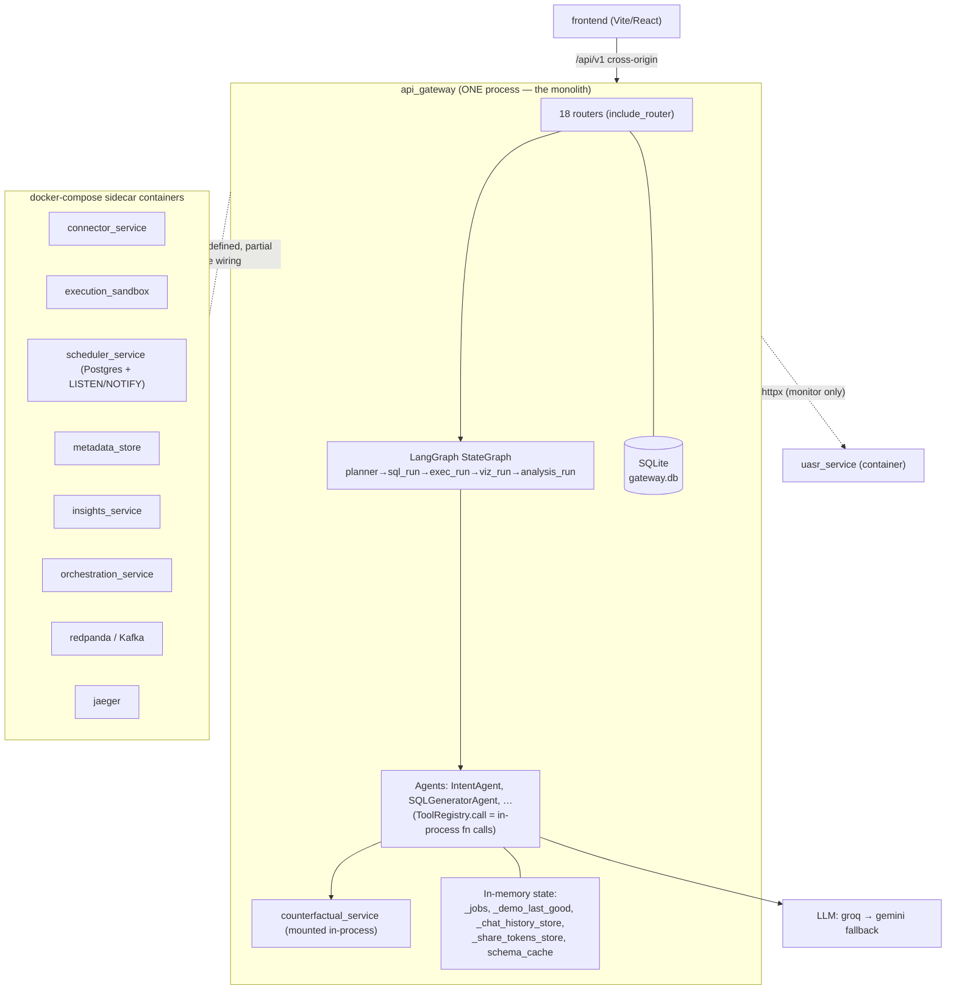

# AURA — Architecture Audit

> Principal-architect review of the live codebase (not the marketing description).
> Method: read the actual orchestration, service, state, and connector code; cross-
> referenced against six verified 2025–2026 papers on multi-agent orchestration and
> agentic RAG. Every claim below cites a file you can open.

---

## 0. Honest reconciliation: description vs. code

A few things in the framing don't match the source tree. Calling these out first,
because an enterprise/YC technical reviewer will diff your pitch against your repo:

| Claimed | In the code |
|---|---|
| "12 independent microservices communicating across service boundaries" | **Modular monolith.** The gateway `include_router`s ~18 routers in-process; agents reach "services" via in-process `ToolRegistry.call()`, not network calls. ~9 sidecar containers exist in `docker-compose.yml`, but the agentic/analytics path runs *inside* the gateway process. |
| "4 modes: Chat, Database, Visualization, Strategy" | No 4-mode construct exists. The orchestrator has **5 pipeline nodes** (`planner → sql_run → exec_run → viz_run → analysis_run`, `agents/langgraph_orchestrator.py:329-333`). There is no "Strategy" mode in the backend. |
| "Snowflake, BigQuery, MongoDB" connectors | `connectors/` has **bigquery, mysql, postgresql, duckdb, faiss**. **No Snowflake, no MongoDB.** |

None of this is fatal — but the gap between "12-service multi-agent mesh" and
"modular monolith with sidecars" is exactly the structural issue this audit is about.

---

## 1. Current system topology (as built)



**Orchestration:** `agents/langgraph_orchestrator.py` — a `StateGraph` with a fixed
node chain and **conditional edges only for error routing** (`_last_error_node`,
`add_conditional_edges`, lines 336-348). Chat enters with `skip_planner=True`
(`build_graph` START router, line 318-320). State is a Pydantic `OrchestratorState`
passed node-to-node.

**Topology class (per Zhu's taxonomy):** **centralized + static** — a single
hardcoded pipeline. Not hierarchical-supervisor, not peer-to-peer, no
dynamic/adaptive control.

**Inter-"service" communication:** in-process Python calls (`self.tools.call(...)`,
e.g. `specialists/ingestion_agent.py:34`). The only real network hop between
backend processes I found is `monitor_agent.py` → `httpx` → UASR metrics
(line 112-125). There is **no message bus, no MCP, no A2A** between the agentic
components — they share a Python heap.

---

## 2. Three structural vulnerabilities (each observed/verified)

### V1 — No process isolation: the agentic core runs in the web tier, so one heavy agent freezes everything
The counterfactual/analytics engine is mounted **in-process** in the gateway. A
single GIL-bound run (dowhy/econml audit) starved the event loop so hard that even
`GET /health` timed out — observed live this session; it's why the demo had to
pre-compute artifacts out-of-process (`counterfactual_service/warm_demos.py`) and
serve cached. Because inter-"service" calls are function calls, there is **no fault
isolation, no backpressure, no independent scaling** between the latency-sensitive
web tier and the heavy compute agents.
*Evidence:* `api_gateway/main.py` (`include_router` ×18); `counterfactual_service/main.py` mounted in gateway; the live `/health` timeout.
*This is the single highest-severity item.*

### V2 — State fragmentation: critical state is per-process in-memory on top of SQLite
Jobs, demo artifacts, chat history, share tokens, and the schema cache live in
**module-level dicts** (`counterfactual_service/main.py:48 _jobs`, `_demo_last_good`;
`api_gateway/routers/chat.py _chat_history_store`; `routers/queries.py:62
_share_tokens_store`; `shared/cache.py` `schema_cache`/`query_cache`). Gateway
persistence defaults to **SQLite** (`api_gateway/persistence.py:279`). Consequence:
the Helm chart ships an **HPA** (`deploy/helm/aura/templates/backend-hpa.yaml`), but
multiple replicas would diverge instantly — jobs lost on restart, sessions
inconsistent, races on the caches. **Horizontal scale is structurally blocked**
despite the autoscaler existing. (Note: query *history* is already migrated to the
persistence layer — `queries.py:172` — so the pattern to follow already exists.)

### V3 — Single-pass pipeline + up-front context injection: no agentic-RAG loop, token bloat, no adaptive routing
The orchestrator is a **fixed** `planner→sql→exec→viz→analysis` chain whose only
branching is error-exit. There is **no retrieval/reformulation/self-correction
loop**: when SQL fails `EXPLAIN`/execution, the error is surfaced, not re-planned.
The whole schema is injected **up front** (`build_schema_context`), which already
forced a "focus on a single table" hack to avoid blowing
`AURA_MAX_TOKENS_PER_REQUEST` on wide schemas (`api_gateway/routers/chat.py:140-169`)
— i.e. token bloat is already biting. And there's no router that picks the data
source/modality (relational vs vector vs time-series). This is **Traditional RAG**,
not **Agentic RAG** (Neha 2025).

---

## 3. Refactoring roadmap — next 3 engineering tasks

Ordered by leverage. Each maps to a verified paper (links in §4). No code here, by
request — these are the build tickets.

### Task 1 — Extract the heavy agentic core into an out-of-process worker behind a job queue
**Why:** kills V1. The web tier must never run a GIL-bound audit inline.
**What:** run `counterfactual_service` + the LangGraph orchestrator as a **separate
process/container** (it's already designed for port 8012). The gateway becomes a thin
API that **enqueues** a job (Redis- or Postgres-backed queue — `scheduler_service`
already speaks Postgres + LISTEN/NOTIFY, reuse that pattern) and **polls/streams**
results. Wrap the agentic compute in a deterministic control envelope: fixed timeouts,
bounded retries, a circuit breaker.
**Pattern source:** **ORCHESTRA** (Bellver 2026) — embed LLM/agent compute *inside a
deterministic control flow* so you keep fixed-pipeline guarantees + auditability while
the inside stays adaptive.
**Trade-off:** +1 network hop and a queue to operate (latency, ops surface) in
exchange for fault isolation, backpressure, and independent scaling. Worth it.

### Task 2 — Introduce a shared state plane + a real coordination layer (stop sharing a Python heap)
**Why:** kills V2, and removes the hidden coupling behind V1.
**What:** move `_jobs`/`_demo_last_good`/`schema_cache`/sessions/share-tokens to
**Redis (ephemeral/coordination) + Postgres (durable jobs)**. Then lift routing out
of hardcoded graph edges into an explicit **coordination layer** that is configurable
and separable from agent logic — so topology (centralized vs hierarchical) becomes a
config choice, not a code rewrite. Make cross-component calls go through a **protocol**
(MCP for tool/context access; A2A for agent-to-agent) instead of `ToolRegistry`
in-process imports — that's what turns "modules" into actually-independent services.
**Pattern source:** **Nechepurenko** (coordination as a configurable architectural
layer; 41–87% of MAS failures are coordination defects, not model capability) +
**Adimulam** (MCP + A2A as the interoperable substrate).
**Trade-off:** token/latency overhead of serialized message-passing + a state store to
run, vs. real multi-replica scale, fault isolation, and auditable coordination.

### Task 3 — Upgrade the single-pass pipeline to bounded Agentic RAG (router + reformulation loop + lazy schema)
**Why:** kills V3; directly improves answer accuracy on hard analytics questions.
**What:** add three things *inside* the deterministic LangGraph envelope:
(a) a **router/planner agent** that selects source + modality (relational vs vector vs
time-series) and the right specialist — mirrors Sachenkova's *router → database-agent /
coding-agent* split; (b) a **self-correction loop**: on `EXPLAIN`/exec failure or
empty result, re-retrieve schema + re-plan with the error as context, **capped at N
retries** (the cap *is* the deterministic guardrail); (c) **lazy/iterative schema
retrieval** (retrieve only the tables/columns the question needs) to kill the
up-front token bloat and retire the single-table hack.
**Pattern source:** **Neha** (single-pass → agentic multi-pass) + **Sachenkova**
(NL→SQL/NL→Python router with safe execution) + **ORCHESTRA** (bounded loops inside a
fixed control flow).
**Trade-off:** more LLM round-trips per query (latency, token cost) for materially
higher accuracy + graceful recovery on bad SQL. Bound it with a retry cap and per-step
token budget so worst-case latency stays predictable.

---

## 4. Research foundation (verified — all six exist; findings confirmed, not paraphrased blind)

1. **Zhu (2026), "LLM-Based Multi-Agent Orchestration: A Survey."** Three-topology taxonomy (centralized / decentralized / hierarchical, each ± dynamic control); compares LangGraph, CrewAI, AutoGen, OpenAI Agents SDK on state granularity, token cost, failure recovery. → AURA is *centralized + static*; this names the upgrade axes. https://www.preprints.org/manuscript/202604.2147
2. **Bellver (2026), "ORCHESTRA."** Microservice architecture that embeds LLM agents in a **deterministic control flow** — agentic flexibility + fixed-pipeline auditability. → the envelope for Tasks 1 & 3. https://aclanthology.org/2026.iwsds-1.18/
3. **Nechepurenko (2026), "Coordination as an Architectural Layer."** 41–87% of MAS production failures are **coordination** defects; make coordination a configurable layer separable from agent logic + info access. → Task 2. https://arxiv.org/abs/2605.03310
4. **Neha (2025), "Traditional RAG vs. Agentic RAG."** Single-pass fixed retrieval vs. autonomous agents that plan, iterate retrieval, use tools, reason over intermediate results. → Task 3. https://www.techrxiv.org/users/876974/articles/1325941
5. **Adimulam (2026), "The Orchestration of Multi-Agent Systems."** Unified layer (planning/policy/state/QA) + **MCP** (tool/context access) and **A2A** (peer coordination/negotiation/delegation) as the interoperable substrate; BFSI case studies. → Task 2's protocol layer. https://arxiv.org/abs/2601.13671
6. **Sachenkova (2026), "Agentic RAG for Maritime AIoT" (Lighthouse Bot).** Router + database-agent + coding-agent turn NL into **SQL on relational data and Python on time-series**, distinguishing text-RAG from numeric/tabular RAG; Claude 3.7 ~90% factual correctness. → Task 3's router + NL→SQL/Python pattern. https://www.mdpi.com/1424-8220/26/4/1227

---

## 5. Target topology (resilient, post-roadmap)

```mermaid
sequenceDiagram
    participant FE as Frontend
    participant GW as API Gateway (thin)
    participant Q as Job Queue (Redis/PG)
    participant CO as Coordination Layer
    participant RT as Router Agent
    participant RAG as Agentic RAG loop (retrieve→reformulate, capped N)
    participant SBX as Execution Sandbox
    participant ST as State Plane (Redis+PG)
    participant LLM as LLM (groq→gemini)

    FE->>GW: POST /report {question}
    GW->>Q: enqueue(job) ; return job_id (instant, non-blocking)
    GW-->>FE: 202 {job_id}
    Q->>CO: dispatch(job)
    CO->>RT: route by intent + modality
    RT->>LLM: plan (which source/agent)
    loop bounded retrieval (≤ N, deterministic cap)
        RT->>RAG: retrieve only needed schema/context
        RAG->>LLM: generate SQL / Python
        RAG->>SBX: validate (EXPLAIN) + execute in sandbox
        alt error or empty
            SBX-->>RAG: error ; RAG reformulates with error context
        else success
            SBX-->>RAG: rows / artifact
        end
    end
    RAG->>ST: persist result + audit artifact (signed)
    FE->>GW: GET /report/{job_id} (poll/stream)
    GW->>ST: read
    ST-->>GW: result + verifiable certificate
    GW-->>FE: result
```

**The one-line takeaway:** AURA's *algorithms* (causal engine, signed certificates,
topological scheduler) are genuinely strong and verified. The gap to enterprise-grade
is **architectural plumbing** — process isolation, a shared state plane, a coordination
protocol, and an agentic-RAG loop. Tasks 1→3 close it in dependency order, and each is
grounded in a real, current paper rather than vibes.
