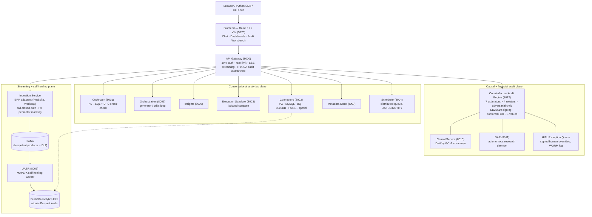
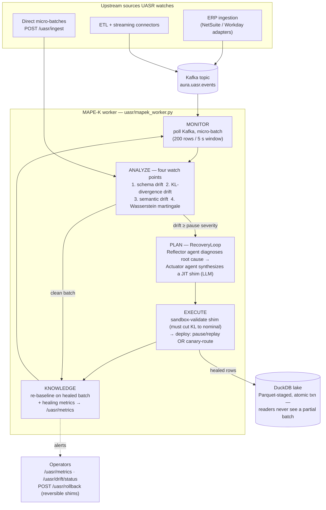

<div align="center">

# AURA

### Auditable Causal Analytics Platform for Global Enterprise

**A microservices platform where autonomous AI agents operate over mission-critical data — every decision cryptographically signed, deterministically replayable, statistically guaranteed, and running on pipelines that heal themselves when upstream data drifts.**

📍 **New here? Start with the [Repository Map](docs/REPO_MAP.md)** — what every directory and service is, and where to find things.

[](https://github.com/THIRD-I-AI/AURA/actions/workflows/ci.yml)
[](https://www.python.org/downloads/)
[](https://www.typescriptlang.org/)
[](https://opensource.org/licenses/MIT)

[Architecture](#architecture) · [Self-Healing Pipelines](#self-healing-pipelines-uasr) · [Audit Engine](#the-audit-engine) · [Financial Audit](#signed-financial-audits-pcaob) · [Security](#enterprise-security-posture) · [Getting Started](#getting-started) · [Deployment](./docs/DEPLOYMENT.md) · [Enterprise Guide](./ENTERPRISE.md) · [Investor Demo](./docs/INVESTOR_DEMO.md)

</div>

---

## Why AURA Exists

Traditional "AI agent platforms" treat AI as a synchronous chat wrapper. That model fails under the throughput, safety, and governance demands of mission-critical data systems for predictable reasons:

1. **Their pipelines are brittle to upstream drift** — one schema rename and the corporate metrics go stale until an on-call engineer triages.
2. **Their LLM outputs are unverified** — a generated SQL query is trusted because it parses, not because it's right.
3. **Their AI decisions are unauditable** — regulators can't reconstruct which model touched which record, with which evidence, under which threshold.
4. **Their "compliance" is cosmetic** — PII handling, auth, and audit trails bolted on after the fact, silently bypassable.

AURA is architected for the production shape that defeats those wrappers: a conversational analytics plane for operators, a **causal + financial audit engine** that signs everything it concludes, and a **self-healing streaming plane (UASR)** that keeps data flowing when upstream systems change underneath it.

---

## Architecture

Thirteen FastAPI microservices, each instantiated through one standardized `create_service()` chassis (uniform JWT auth, rate limiting, security headers, Prometheus hooks, request-ID tracing). The frontend connects only through the API Gateway.



**Cross-cutting infrastructure:** TRAIGA hash-chained audit log with RFC 6962 Merkle tree + signed tree heads + inclusion proofs; ED25519 artifact signing with key revocation; HMAC-keyed PII tokenization; Aura Vault for connector secrets; in-process pub/sub streaming bus; outbound HMAC-signed webhooks; 11 auto-generated typed SDK clients kept byte-stable by CI.

---

## Self-Healing Pipelines (UASR)

**The problem.** Enterprises lose enormous operational velocity to upstream drift: a renamed column, a type change, a regional date format, a vendor switching units. Downstream pipelines crash or — worse — silently produce wrong numbers until someone notices.

**Where UASR sits.** The Universal Agentic Semantic Recovery module (`aurabackend/uasr/`) sits **between the Kafka spine and the analytics lake**. Every micro-batch flowing toward DuckDB passes through its MAPE-K (Monitor–Analyze–Plan–Execute–Knowledge) loop. Nothing reaches the lake unexamined; nothing drifted reaches the lake unhealed.



### The four watch points

Each incoming batch is checked against a per-source registered baseline (`POST /uasr/baseline`):

| # | Watch point | What it catches | Mechanism |
|---|------------|-----------------|-----------|
| 1 | **Schema drift** | Column added / removed / type changed | Set-diff + dtype comparison vs. schema baseline. Removals escalate severity; losing >50% of columns is CRITICAL. |
| 2 | **Statistical drift** | Distribution shift in any column | Per-column KL-divergence D<sub>KL</sub>(batch ∥ baseline) against an **adaptive threshold** ζ = mean + 2σ of KL history, plus a >2σ location-shift check so range explosions (10–500 → 10k–500k) can't hide behind matching histogram shapes. |
| 3 | **Semantic drift** | "Same schema, different meaning" | Cosine distance between a feature-hashed batch embedding and the source's reference context matrix — no external model required. |
| 4 | **Wasserstein martingale** *(opt-in, S18.1)* | Slow statistical creep below KL's radar | Per-column exchangeability martingale on W₁ distances with an **Azuma-Hoeffding bound: provable false-alarm rate ≤ α**. When this alarm fires, the drift is mathematically guaranteed real. Fails open to detector 1–3 on columns without baselines. |

### The healing path

When drift crosses the pause threshold, the worker does **not** drop the batch and does **not** lose Kafka offsets:

1. **Pause** — consumer polling gates on an `asyncio.Event`; offsets are preserved, the consumer stays alive.
2. **Diagnose** — the `DiagnosticReflectorAgent` reasons over the drift vector (affected columns, KL values, old/new types) to a root cause.
3. **Synthesize** — the `SynthesisActuatorAgent` writes a just-in-time transformation shim (e.g., rename the column back, coerce the type, rescale the unit).
4. **Validate** — the shim runs in a sandbox against the drifted batch; it deploys only if it reduces D<sub>KL</sub> back to nominal. With the opt-in **causal-RL evaluator** (S18.1b), all validated candidates compete and the winner is chosen by counterfactual expected improvement, not greedily.
5. **Deploy** — two modes: classic *pause → apply shim → replay → resume*, or the **canary ShimRouter** (S18.1c) which keeps ingestion running and gives the new shim a fractional traffic weight that is promoted or reverted based on drift re-detection.
6. **Learn** — the healed batch becomes the new baseline (so the same drift never re-fires), the healing event lands in `/uasr/metrics`, and the shim is reversible at any time via `POST /uasr/rollback`.

If recovery fails validation, the consumer **stays paused** — fail-closed, no corrupted data reaches the lake — and the failure is surfaced as an alert rather than swallowed.

---

## The Audit Engine

The engine at `aurabackend/counterfactual_service/` (port 8012) produces a single canonical, signed artifact per causal query, then renders it for three audiences from the same persisted bytes.

### Query lifecycle

1. **Submit** — `POST /counterfactual/jobs` (treatment, outcome, DAG, dataset, audience) or one-click `POST /demo` scenarios.
2. **Fan out** — up to 7 estimators run on the same identification:

| Estimator | Bias guarantee | CI |
|---|---|---|
| `linear_regression` | Unbiased if confounders observed | Asymptotic normal |
| `ipw` | Consistent if propensity correct | Asymptotic normal / bootstrap |
| `psm` | Consistent if propensity correct | Bootstrap |
| `double_ml` (LinearDRLearner) | **Doubly robust** — either nuisance model may be wrong | Asymptotic + **opt-in conformal** (finite-sample, distribution-free) |
| `forest_dr` (ForestDRLearner) | Doubly robust + non-parametric CATE | Bootstrap-of-Little-Bags + opt-in conformal |
| `tmle` | Doubly robust, targeted, achieves efficiency bound | Influence-curve based |
| `iv_2sls` | Consistent under unobserved confounding given a valid instrument | 2SLS asymptotic |

3. **Refute** — placebo treatment, random common cause, data-subset robustness, unobserved-confounder sensitivity.
4. **Sensitivity** — an **E-value + Cinelli-Hazlett `SensitivityReport` ships with every estimate**: how strong would hidden confounding need to be to explain the effect away.
5. **Adversarial critique** — an LLM critic (cached, time-bounded, off the critical path) emits structured challenges; deterministic challenges fire on fragile propensity overlap and on **cross-estimator disagreement** (TMLE vs. ForestDR beyond 2× CI half-width).
6. **Verdict** — one canonical `significance_verdict()` decides what the headline may claim; a point estimate whose CI crosses zero is *never* reported as "impact detected".
7. **Seal** — canonical JSON → SHA-256 → ED25519 signature → disk + TRAIGA audit log.
8. **Replay & verify** — `GET /counterfactual/artifacts/{hash}` is byte-identical re-execution (Layer-10 determinism contract: per-method seeds derived from the request hash, sequential fan-out); `/verify` checks the signature; bulk replay streams NDJSON for auditor sweeps.

### Trustworthy SQL, too

The conversational plane gets the same treatment: **DPC (Dual-Paradigm Cross-check)** independently solves each generated SQL query with an AST-sandboxed pandas program and compares results — tri-state `verified / mismatch / skipped` with bounded retry. An LLM agreeing with itself is not verification; two different computational paradigms agreeing is.

---

## Signed Financial Audits (PCAOB)

AURA's flagship vertical: autonomous financial audit mapped directly to PCAOB Auditing Standards, with a human-in-the-loop exception queue. See [docs/INVESTOR_DEMO.md](./docs/INVESTOR_DEMO.md) for the 4-act walkthrough.

| Standard | What the agent does |
|---|---|
| **AS 2110** | Risk assessment: establishes materiality thresholds before scanning |
| **AS 2305** | Substantive analytical procedures: variance scanning against materiality |
| **AS 2201** | Internal controls: PO ↔ invoice matching |
| **AS 2401** | Fraud: duplicate-payment detection keyed on (amount, account, vendor) + round-dollar anomalies |
| **AS 1215** | Engagement completion document — assembled, ED25519-signed, hash-addressed, independently verifiable |

**Human-in-the-loop:** every finding requiring review lands in the exception queue (`frontend` → Audit Workbench). Approve/override decisions are signed `HumanOverrideRecord`s — identity taken from the JWT `sub`, never the request body — appended to a WORM audit log. The signed artifact keeps raw evidence for verifiability; **client-facing views are PII-masked at egress** with HMAC-keyed deterministic tokens, so auditors can correlate entities across findings without ever seeing raw PII.

**Ingestion is fail-closed:** ERP ingestion endpoints require JWT bearer auth (401 without), and a pure-ASGI PII perimeter masks restricted fields *before* payloads reach Kafka. A Kafka outage degrades publishing (with DLQ + lazy retry) but never takes the service down.

---

## Enterprise Security Posture

- **Armed production gates** — with `ENVIRONMENT=production`, boot *fails* on open auth mode, default `SECRET_KEY`, or wildcard/http CORS. The Helm chart pins these on.
- **PII fail-safe** — without `AURA_PII_TOKEN_KEY`, egress falls back to blanket `[REDACTED]`; an unkeyed deterministic hash (dictionary-invertible) is never emitted.
- **Signing-key lifecycle** — persistent ED25519 keys, admin-gated revocation; signing refuses revoked key IDs.
- **TRAIGA + Merkle federation** — hash-chained audit events, RFC 6962 signed tree heads, inclusion proofs for third-party verification.
- **Service chassis** — every microservice inherits rate limiting, security headers, JWT auth, and exception-to-JSON handling from `create_service()`; per-service security review is unnecessary by construction.
- **CI security lanes** — CodeQL, Bandit, Dependabot (clean as of 2026-06), Schemathesis contract fuzzing.

The full 10-item production deployment checklist lives in [ENTERPRISE.md](./ENTERPRISE.md).

---

## Getting Started

### Prerequisites

- Python 3.11+ (3.12 for the full eval-gate) · Node 18+
- One LLM provider key (Groq / Gemini / OpenAI) or local Ollama
- Optional: Docker (Kafka, full compose stack), Postgres (distributed scheduler)

### Install

```bash
git clone https://github.com/THIRD-I-AI/AURA.git
cd AURA

# Backend
cd aurabackend
python -m venv .venv && .venv\Scripts\activate   # POSIX: source .venv/bin/activate
pip install -r requirements.txt
pip install -r requirements-causal.txt           # dowhy, econml — for the audit engine

# Frontend
cd ../frontend && npm install

# SDK (optional)
cd ../sdk && pip install -e .
```

### Configure

```bash
cp aurabackend/.env.example aurabackend/.env
```

Set one LLM key, plus (recommended for the audit engine):

```
AURA_SIGNING_PRIVATE_KEY_HEX=<64 hex>   # persistent report-signing key
AURA_PII_TOKEN_KEY=<long random>        # keyed PII tokenization at egress
```

### WSL / Windows note

If you run the backend from **WSL** against a repo checked out on the Windows
drive (`/mnt/c/...`), SQLite writes to tracked files on the `drvfs` mount can
fail with `attempt to write a readonly database`. The test suite avoids this
by pointing the gateway DB at an ext4 temp dir automatically. For the running
app, either keep the checkout on the Linux filesystem (e.g. `~/AURA`) or set
`GATEWAY_DATABASE_URL` to a path under `/tmp` or `$HOME`:

```bash
export GATEWAY_DATABASE_URL="sqlite+aiosqlite:///$HOME/aura_gateway.db"
```

### Run

```powershell
cd aurabackend
.\start_all.ps1                                   # core services (POSIX: bash start_all.sh)
python -m uvicorn counterfactual_service.main:app --port 8012   # audit engine
```

```bash
cd frontend && npm run dev      # http://localhost:5173
```

### Verify

```bash
for p in 8000 8001 8002 8003 8004 8005 8006 8007 8009 8012; do
  curl -s http://localhost:$p/health | jq -r '"\(.service): \(.status)"'
done
curl -s -X POST http://localhost:8012/demo -H "Content-Type: application/json" \
  -d '{"scenario": "fair_lending"}' | jq .confidence
```

### Deploy to production

The steps above are for local dev. To deploy a durable, authenticated instance —
cloud SaaS, semi-cloud/hybrid (customer-hosted LLM), or fully on-prem/air-gapped
(local Ollama) — follow **[docs/DEPLOYMENT.md](./docs/DEPLOYMENT.md)**, the
hands-on Compose + Helm guide for all three targets.

---

## SDK & CLI

```python
from aura_counterfactual import Client

with Client(base_url="http://localhost:8012", prefix="") as c:
    artifact = c.run({...})                    # blocks to completion
    again = c.replay(artifact.audit_record_hash)   # byte-identical
    assert c.verify(artifact.audit_record_hash).verified
```

```bash
aura-counterfactual replay 0xabc... && aura-counterfactual report 0xabc... -o audit.pdf
```

Exit codes are CI-gradable (`0=ok … 5=verify_failed`). Beyond the hand-written audit SDK, `sdk_clients/` holds **11 auto-generated typed clients** (one per service, 160+ methods) regenerated from each service's OpenAPI schema and kept byte-stable by the CI codegen-sync gate.

---

## Frontend

React 19 + Vite SPA, strict TypeScript, design-system components (CSS variables, no utility-class framework). 14 lazy-loaded pages including the **Audit Workbench** — the live HITL surface where auditors review the exception queue and sign override decisions. An enterprise-wide visual redesign (S37 "Terminal Authority") is in flight.

---

## Project History & Roadmap

Development runs as numbered sprints with a public registry — see **[docs/SPRINTS.md](./docs/SPRINTS.md)** for what's done, in flight, and next. Highlights: S8–S16 counterfactual engine, S17 multi-modal fabric, S18 self-healing + causal-RL, S19 Merkle federation, S20 distributed scheduler, S21 SDK codegen, S22–S24 analytic depth (TMLE, E-values, disagreement challenges), S31–S35 the financial-audit vertical + HITL workbench, Sec-1–Sec-7 security hardening.

---

## References

- Robins, Rotnitzky & Zhao (1994) — doubly-robust estimation. JASA 89.
- Chernozhukov et al. (2018) — DML / cross-fitting. Econometrics J. 21(1).
- Wager & Athey (2018); Athey, Tibshirani & Wager (2019) — honest forests / GRF.
- van der Laan & Rose (2011) — Targeted Maximum Likelihood Estimation.
- Lei & Candès (2021) — conformal counterfactual inference. JRSS-B 83(5).
- VanderWeele & Ding (2017) — E-values. Annals of Internal Medicine.
- Cinelli & Hazlett (2020) — sensitivity analysis. JRSS-B 82(1).
- Kallus & Uehara (2020) — causal RL / efficient off-policy evaluation. JMLR.
- RFC 6962 — Certificate Transparency (Merkle audit log design).
- RFC 8785 — canonical JSON (hash basis); Bernstein et al. (2012) — ED25519.
- PCAOB AS 1215 / 2110 / 2201 / 2305 / 2401 — auditing standards implemented by the financial-audit agent.
- Texas Responsible AI Governance Act (TRAIGA) — audit-log traceability design.

---

## Contributing

```bash
cd aurabackend
python -m ruff check . --ignore E501,E402,F401,E701,E712     # CI-exact lint
python -m pytest tests/<files_you_touched> --tb=short

cd ../frontend
npx tsc --noEmit && npx eslint src --max-warnings 0 && npx vitest run
```

All CI jobs must be green before merge. Conventions (sprint claiming, branch naming, commit style) live in [CLAUDE.md](./CLAUDE.md); the sprint registry is [docs/SPRINTS.md](./docs/SPRINTS.md).

---

## License

MIT — see [LICENSE](LICENSE).
