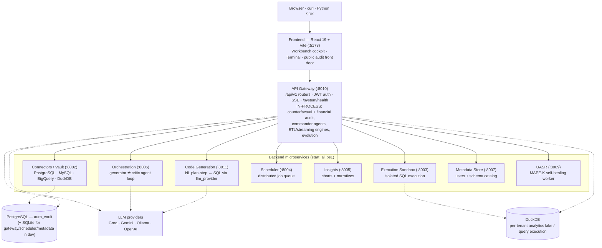

<div align="center">

# AURA

### Auditable Causal Analytics Platform

**Ask questions about your data in plain English and get causally-grounded, cryptographically-signed, replayable answers.** AURA is a FastAPI microservices platform fronted by a single API gateway, driven by a React cockpit. Natural-language questions become verified SQL; causal and forensic-financial audits are ED25519-signed and appended to a tamper-evident ledger; and the streaming ingestion plane heals itself when upstream data drifts.

</div>

---

## Table of contents

- [What AURA does](#what-aura-does)
- [Key features](#key-features)
- [Architecture](#architecture)
- [How a query flows end-to-end](#how-a-query-flows-end-to-end)
- [Tech stack](#tech-stack)
- [Getting started (run it locally)](#getting-started-run-it-locally)
- [Auth model](#auth-model)
- [Repository layout](#repository-layout)
- [Testing](#testing)
- [Further reading](#further-reading)

---

## What AURA does

Traditional "chat with your data" tools trust an LLM's SQL because it parses, produce answers nobody can reconstruct later, and break the moment an upstream column is renamed. AURA is built around three ideas that fix those failure modes:

1. **Verified answers, not just generated ones.** Generated SQL is executed against a real engine (DuckDB), critiqued by a second agent, and (for causal work) cross-checked by an independent computational paradigm.
2. **Everything consequential is signed.** Causal audits and forensic financial audits are serialized to canonical JSON, hashed (SHA-256), signed (ED25519), and appended to a hash-chained ledger with a Merkle root — so a decision can be replayed and independently verified.
3. **The data plane heals itself.** The UASR self-healing worker watches ingestion for schema/statistical/semantic drift and synthesizes just-in-time repair shims (with an optional human approval gate) instead of letting pipelines silently produce wrong numbers.

The whole platform is delivered as one authenticated web app — the **Workbench cockpit** — plus a public audit front door where anyone can verify a signed certificate by its hash.

---

## Key features

- **Natural-language → SQL commander.** `POST /api/v1/chat` classifies intent (conversation / SQL / pipeline / audit), builds a live schema context from your uploaded datasets, generates SQL through an LLM, executes it on DuckDB, and returns rows plus a chart suggestion and narrative. An optional agentic **Commander** streaming loop (`POST /api/v1/chat/stream`, behind the `AURA_COMMANDER_ENABLED` flag) exposes the same capability as a tool-calling agent over Server-Sent Events.
- **Causal / counterfactual audit engine.** Multiple treatment-effect estimators (linear regression, IPW, PSM, double-ML, forest-DR, TMLE, IV-2SLS) run behind `POST /api/v1/counterfactual/jobs`, paired with refuters, sensitivity analysis (E-values), an adversarial LLM critic, and a canonical significance verdict. Results are signed and replayable byte-for-byte.
- **Forensic financial audit.** `POST /api/v1/counterfactual/audit/financial` (and a one-click `.../financial/demo`) runs PCAOB-aligned techniques — Benford's-law first-digit analysis and duplicate/round-number detection (AS 2401), three-way match / segregation-of-duties (AS 2201), and expectation/outlier analytics (AS 2305) — emits findings, and produces a signed AS 1215 completion document. Findings needing review land in a human-in-the-loop exception queue where approve/reject decisions are themselves signed.
- **Tamper-evident audit ledger.** Signed artifacts are chained; `GET /api/v1/counterfactual/audit/ledger/verify` returns the record count, Merkle root, and an `ok` integrity flag. The cockpit degrades honestly to "LEDGER CHAIN BROKEN" if verification fails.
- **Self-healing streaming (UASR / MAPE-K).** The UASR service (`:8009`) detects schema, statistical (KL-divergence), and semantic drift on incoming micro-batches, then diagnoses and synthesizes repair shims. A supervised mode routes proposals to a **Healing Queue** for signed human approval (`/api/v1/uasr/recovery/pending|approve|reject`).
- **ETL + streaming pipeline builders.** Build batch ETL pipelines (`/api/v1/etl/*`, `/api/v1/pipeline/*`) or windowed streaming pipelines (`/api/v1/streaming/*`) — including from a natural-language instruction — with sources/sinks/transforms rendered from backend schemas.
- **Multi-tenant SaaS auth.** JWT-based login carries an `org_id` tenant claim taken from the verified token (never a request header); every data store is scoped to it when JWT enforcement is on.
- **Two authenticated surfaces.** The **Workbench** cockpit (dense board + ⌘K palette + live System Radar) and the **Terminal** cockpit (a dockview panel grid with a Constellation lineage graph built on React Flow).
- **Operational plumbing.** Dashboards, saved-query library with schedules and share links, data lineage (sqlglot), outbound/inbound webhooks, LLM cost/token accounting, and a unified `/system/health` aggregator.

---

## Architecture

Every microservice is built through one `create_service()` chassis (`aurabackend/shared/service_factory.py`), which uniformly wires CORS, rate limiting, optional JWT/API-key middleware, request-ID tracing, security headers, an optional TRAIGA audit-log middleware, Prometheus metrics, optional OpenTelemetry, and a standard `GET /health`. **The frontend talks only to the API gateway**, which mounts every domain router under `/api/v1` and aggregates per-service health at `/system/health`.

Notably, several capabilities described as "services" run **in-process inside the gateway** rather than as separate uvicorn processes: the counterfactual/financial-audit engine (`counterfactual_service`, mounted via `api_gateway/routers/counterfactual.py`), the agentic chat/commander loop (`agents/`), the ETL/streaming pipeline engines (`pipeline/`), and the evolution engine (`evolution/`). The nine processes launched by `start_all.ps1` are the ones below.



### Services and ports

| Service | Port | Uvicorn target | Responsibility |
|---|---|---|---|
| **API Gateway** | 8010 | `api_gateway.main:app` | Single entry point. Mounts every `/api/v1` router (chat, files, connections, queries, dashboards, lineage, etl, pipelines, streaming, webhooks, counterfactual, auth, workspaces, approvals…). Runs the counterfactual/financial-audit engine and commander agents in-process. Aggregates `/system/health`; broadcasts SSE. |
| **Code Generation** | 8011 | `code_generation_service.main:code_gen_app` | Turns a plan step into a PostgreSQL query via `shared/llm_provider`; fails loud (503/502) when no LLM is configured. |
| **Connectors / Vault** | 8002 | `connectors.main:app` | External data-source connections (PostgreSQL, MySQL, BigQuery, DuckDB) plus a connector registry the UI renders generically. Reported as `database_service` in health. |
| **Execution Sandbox** | 8003 | `execution_sandbox_service.main:execution_app` | Isolated SQL execution service. |
| **Scheduler** | 8004 | `scheduler_service.main:scheduler_app` | Distributed job queue / cron-style schedules for saved queries and pipelines. |
| **Insights** | 8005 | `insights_service.main:app` | Auto-generates insights, chart specs, and narratives from query results. |
| **Orchestration** | 8006 | `orchestration_service.main:app` | Generator ⇄ Critic agent loop (`TinyRecursiveCoordinator`, MCP tool descriptors). |
| **Metadata Store** | 8007 | `metadata_store.main:metadata_app` | Users table (auth backing store) and schema registry / catalog. |
| **UASR** | 8009 | `uasr.service:app` | Self-healing MAPE-K worker: drift detection, recovery shims, `Hᵤ` healing metrics. |

`GET /system/health` on the gateway polls seven of these plus itself, so a fully-up stack reports **8 healthy services** (the orchestration service on 8006 is not part of the health roll-up).

---

## How a query flows end-to-end

Tracing a plain-English question through the code (`aurabackend/api_gateway/routers/chat.py`):

1. **Frontend → gateway.** The Workbench/Terminal calls `POST /api/v1/chat` (or streams `POST /api/v1/chat/stream`) via `frontend/src/services/api.ts`, with the bearer token and an `X-Workspace-Id` header on every request.
2. **Schema context.** The gateway opens a per-tenant DuckDB connection, loads that workspace's uploaded datasets, and builds a schema context (columns, types, sample data, relationships), trimming to a token budget when needed.
3. **Intent classification.** `IntentAgent` labels the message `conversation`, `sql`, `pipeline`, or `audit`. Conversational replies short-circuit; `pipeline` builds and saves a real ETL pipeline; `audit` runs the forensic auditor on the dataset's monetary column and returns a signed certificate.
4. **NL → SQL.** For `sql` intent, `run_orchestrator` (a LangGraph flow) generates SQL — the code-generation path is LLM-backed through `shared/llm_provider` (Groq → Gemini → Ollama → OpenAI auto-detection with fallback + response caching), and a critic reviews it. AURA also ships DPC (Dual-Paradigm Cross-check) that independently re-solves a query with a sandboxed pandas program to confirm the SQL result.
5. **Execution.** The SQL runs on DuckDB; rows, columns, an optional chart spec, and a conclusion are collected into the typed response. Errors are humanized (rate-limit / no-LLM / execution messages) rather than leaked verbatim.
6. **Persistence + signing.** The query is recorded in tenant-scoped history. For audits, the completion document is built, ED25519-signed, and persisted to the ledger (`counterfactual_service.financial_report.sign_and_persist`); the UI can then open `/verify/<hash>` to check the signature independently.

The Commander streaming variant runs the same intent set as an agentic tool-loop (`agents/commander.py`) in a worker thread, emitting typed SSE frames (`tool_call`, `tool_result`, `text`, `error`) that the cockpit renders live.

---

## Tech stack

**Backend** — Python 3.11+, FastAPI, Pydantic v2 / pydantic-settings, SQLAlchemy + Alembic, PostgreSQL (the `aura_vault` database) with SQLite for the gateway/scheduler/metadata stores in dev, DuckDB for per-tenant query execution and the analytics lake, and LLMs via `shared/llm_provider` (Groq, Gemini, Ollama, OpenAI — auto-detected, with a fallback chain and content-addressable caching). Cross-cutting: ED25519 signing, hash-chained + Merkle audit ledger, Prometheus metrics, optional OpenTelemetry/Sentry, optional Kafka for streaming ingestion.

**Frontend** — React 19, Vite 8, TypeScript ~5.9, Tailwind CSS v4 with shadcn/ui (style `new-york`, primitives in `src/components/ui-kit/`), `react-router-dom` v7, `dockview-react` (Terminal panel grid), `@xyflow/react` / React Flow + `d3-force` (Constellation lineage graph), Recharts (charts), `motion` (animation), `lucide-react` (icons), and Vitest + Testing Library + Playwright for tests. The frontend design system is mandatory and documented in `frontend/CLAUDE.md`.

**SDK** — a hand-written `aura-counterfactual` client under `sdk/`, plus per-service typed clients auto-generated from each OpenAPI schema under `sdk_clients/`.

---

## Getting started (run it locally)

This section reflects **this machine's actual setup**. Ports differ from the defaults because a `claude-science` daemon occupies 8000 and 8001, so the gateway runs on **8010** and code-gen on **8011** (already set in `start_all.ps1`).

### Prerequisites

- **Python 3.11+** in a repo-root virtual environment at `.venv` (`start_all.ps1` prefers `.venv/Scripts/python.exe`).
- **Node 20+** for the frontend.
- **A reachable PostgreSQL.** This box points at `192.168.1.92:5432/aura_vault` via the repo-root `.env` (`DB_HOST`, `DB_PORT`, `DB_NAME`, `DB_USER`, `DB_PASSWORD`).
- **An LLM key** in the repo-root `.env`: `GROQ_API_KEY` (default provider) or `GEMINI_API_KEY` (or point `OLLAMA_HOST` at a local Ollama for a fully offline model).
- Auth is `AURA_AUTH_MODE=password` (set in `.env`).

> Configuration is env-var driven through `aurabackend/shared/config.py`, which loads `aurabackend/.env` then the repo-root `.env`. Never commit secret values — set the variable **names** above. In `production`, config validators hard-fail on open auth, the default `SECRET_KEY`, wildcard/`http` CORS, and `AURA_JWT_ENABLED=false`.

### 1. Backend

```powershell
cd aurabackend
.\start_all.ps1
```

This sweeps any stale AURA python processes, loads `.env`, and launches the nine services in separate windows:

| Window | URL |
|---|---|
| API-Gateway | http://localhost:8010 |
| Code-Generation | http://localhost:8011 |
| Connectors-Vault | http://localhost:8002 |
| Exec-Sandbox | http://localhost:8003 |
| Scheduler | http://localhost:8004 |
| Insights | http://localhost:8005 |
| Orchestration | http://localhost:8006 |
| Metadata-Store | http://localhost:8007 |
| UASR-Service | http://localhost:8009 |

`.\start_all.ps1 -Kill` stops the stack without relaunching. (A POSIX `start_all.sh` also exists.)

### 2. Frontend

```bash
cd frontend
npm install
npm run dev          # Vite dev server on http://localhost:5173
```

The frontend targets the gateway via `VITE_API_URL`; this repo's `frontend/.env.local` sets it to `http://localhost:8010`. The app's Content-Security-Policy only allows `connect-src` to the gateway on `:8000`/`:8010`, so the gateway **must** be on one of those (it is — `:8010`).

### 3. First use

Open **http://localhost:5173**, choose **Create an account** (or sign in with an existing one), and you land in the **`/workbench`** cockpit. Upload a CSV/Parquet from **Files & Data**, then ask a question in **Ask AURA**.

### 4. Health check

```bash
curl http://localhost:8010/system/health
```

A healthy stack reports `"overall": "healthy"` with **8 healthy services** and, when UASR is up, an `hu_score`.

---

## Auth model

There is one real login. The flow lives in `aurabackend/api_gateway/routers/auth.py` and `frontend/src/services/api.ts`:

- **Login** — the frontend `POST`s `/api/v1/auth/token`. In **password mode** (`AURA_AUTH_MODE=password`, this machine's setting) it validates `email` + `password` against the `users` table with bcrypt and mints a JWT. In **open mode** (dev default) it issues a token for any `user_id` with no credential check.
- **Register** — `POST /api/v1/auth/register` creates a bcrypt-hashed user; new accounts get their own `org_id` (single-user tenant).
- **SSO** — an optional generic OIDC (authorization-code + PKCE) flow (`/api/v1/auth/oidc/*`) covers Entra/Okta/Google/Auth0/Keycloak; the JWT never transits a URL (a single-use handoff code is exchanged via `POST /auth/oidc/exchange`).
- **Route gating** — `ProtectedRoute` guards `/workbench` and `/app/terminal`; the public routes (`/`, `/login`, `/signup`, `/audit/*`, `/certificate/:hash`, `/verify/:hash`) are open so anyone can verify a signed certificate.
- **Tenancy** — the multi-tenant `org_id` is read from the verified token, never from the request body/header. Data isolation is fully enforced when `AURA_JWT_ENABLED=true` (required in production); with it off, requests collapse to a shared `default` workspace — fine for single-user dev, unsafe in prod.

---

## Repository layout

```
Data-Analyst-Agent/
├─ README.md              — this file
├─ ARCHITECTURE.md        — service topology (existing)
├─ ENTERPRISE.md          — deployment + compliance posture
├─ STREAMING_FOUNDATIONS.md — math behind the streaming primitives
├─ CLAUDE.md              — shared dev conventions (sprints, branching, CI)
├─ docker-compose*.yml    — container stacks
├─ aurabackend/           — all backend services
│  ├─ start_all.ps1 / .sh — canonical local launcher (9 services)
│  ├─ api_gateway/        — the gateway: main.py, routers/, persistence.py
│  ├─ code_generation_service/  — NL → SQL (LLM)
│  ├─ connectors/         — data-source connectors + registry (:8002)
│  ├─ execution_sandbox_service/ — SQL execution (:8003)
│  ├─ scheduler_service/  — distributed job queue (:8004)
│  ├─ insights_service/   — charts + narratives (:8005)
│  ├─ orchestration_service/ — generator ⇄ critic agents (:8006)
│  ├─ metadata_store/     — users + schema catalog (:8007)
│  ├─ uasr/               — MAPE-K self-healing (:8009)
│  ├─ counterfactual_service/ — causal + financial audit engine (in-process)
│  ├─ agents/             — commander tool-loop + specialists + LangGraph
│  ├─ pipeline/           — ETL + streaming pipeline engines
│  ├─ evolution/          — self-evolution engine
│  ├─ shared/             — config, service_factory, llm_provider, auth,
│  │                        signing, audit ledger, middleware
│  ├─ alembic/            — DB migrations
│  └─ tests/ tests_e2e/ tests_contract/ — pytest suites
├─ frontend/              — React 19 + Vite + Tailwind v4 + shadcn/ui
│  └─ src/
│     ├─ AppRoutes.tsx    — routes (front door, login, workbench, terminal, verify)
│     ├─ services/api.ts  — typed API client (API_BASE_URL = VITE_API_URL + /api/v1)
│     ├─ workbench/       — the primary cockpit: Workbench.tsx, panels/, viewRegistry.ts
│     ├─ terminal/        — dockview cockpit + Constellation graph
│     ├─ audit/           — public front door, certificate, verify pages
│     ├─ auth/            — AuthForm, ProtectedRoute, AuthContext, SSO callback
│     └─ components/ui-kit/ — shadcn/ui primitives (the design system)
├─ sdk/                   — hand-written aura-counterfactual SDK
├─ sdk_clients/           — auto-generated per-service typed clients
├─ scripts/               — codegen + dev helpers
└─ docs/                  — SPRINTS.md, DEPLOYMENT.md, REPO_MAP.md, INVESTOR_DEMO.md, …
```

---

## Testing

**Backend** (from `aurabackend/`):

```bash
python -m ruff check --fix . --ignore E501,E402,F401,W191,W291,W293,F841,E701,E712,F823
python -m pytest tests/<the_file_you_touched>.py --tb=short
```

The full suite is large (the pre-push run takes roughly 12 minutes); run only the files you touched during iteration and let CI run the rest. Optional-dependency tests (Postgres, dowhy/econml, faiss, aiokafka) are gated and have dedicated CI lanes.

**Frontend** (from `frontend/`):

```bash
npx tsc --noEmit && npx eslint src --max-warnings 0 && npx vitest run
```

CI must be green before merge. See `CLAUDE.md` for the sprint/branch/commit conventions and the full pre-push protocol.

---

## Further reading

- **`ARCHITECTURE.md`** — deeper service topology.
- **`ENTERPRISE.md`** — production hardening + compliance checklist.
- **`STREAMING_FOUNDATIONS.md`** — formal math behind the streaming/self-healing primitives.
- **`docs/SPRINTS.md`** — the development sprint registry.
- **`docs/DEPLOYMENT.md`** — cloud / hybrid / on-prem deployment guide.
