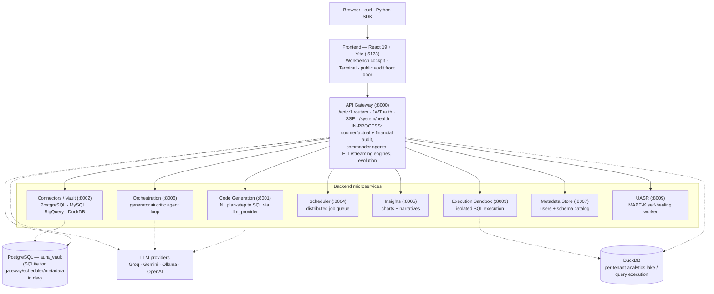

<div align="center">

# AURA

### Auditable Causal Analytics Platform

**Ask questions about your data in plain English and get answers you can re-derive, verify, and defend.**

[](https://github.com/THIRD-I-AI/AURA/actions/workflows/ci.yml)


</div>

AURA is a FastAPI microservices platform behind a single API gateway, driven by a React cockpit.
Natural-language questions become executed-and-critiqued SQL; causal and forensic-financial audits are
ED25519-signed and appended to a hash-chained ledger; and a MAPE-K worker watches ingestion for drift.

> **Read this first.** This README aims to be accurate rather than flattering. Several capabilities
> below are real and verified end-to-end; several are partial and marked as such. The
> [Status at a glance](#status-at-a-glance) table is the honest summary — the feature sections assume
> you have read it.

---

## Status at a glance

| Capability | State | What that actually means |
|---|---|---|
| NL → SQL chat over your uploads | ✅ Working | Executed on DuckDB, critiqued by a second agent, returns rows + chart + narrative. |
| Causal / counterfactual engine | ✅ Working | 7 estimators + refuters + E-value sensitivity; results replay byte-for-byte. |
| Forensic financial audit (PCAOB-aligned) | ✅ Working | Benford / three-way match / expectation analytics; signed AS-1215 completion doc. |
| Signed, tamper-evident audit ledger | ✅ Working | Hash chain + Merkle root; `/audit/ledger/verify` returns an `ok` flag the UI trusts. |
| Public certificate verification | ✅ Working | Anyone can verify a signed certificate by hash without an account. |
| Drift **detection** (UASR) | ✅ Working | Schema, statistical (KL + Wasserstein martingale), and semantic drift, live. |
| Drift **repair** (UASR auto-heal) | 🟡 Partial | See [Self-healing](#self-healing-what-is-and-is-not-automatic). Detection is real; unattended repair is not yet demonstrated end-to-end. |
| Multi-tenant isolation | 🟡 Partial | Enforced on uploads, files, query history, workspaces, semantic models. **Not** on several metadata tables — see [Tenancy](#tenancy-exactly-what-is-scoped). |
| Human-in-the-loop approval queues | ✅ Working | Exception queue and Healing Queue; approve/reject decisions are themselves signed. |
| Deployment | 🟡 Single-node | Runs live on one t3.micro via `deploy/aws-free-tier/`. No HA, no autoscaling, single uvicorn worker. |
| Backups | 🟡 Script only | `deploy/aws-free-tier/backup.sh` exists; no scheduled off-box retention is configured for you. |

<details>
<summary><b>Known gaps we are not papering over</b></summary>

- **Tenant columns are missing on some metadata tables** (`data_sources`, `documents`,
  `document_embeddings`, `schema_columns`, `dar_insights`, `dataset_profiles`). Reads over those
  tables are not tenant-filtered. `semantic_models` had the same defect and is now scoped.
- **The internal pub/sub bus is tenant-blind** — `webhook_dispatcher` subscribes with `"*"`.
- **One uvicorn worker.** Any blocking call inside an async handler stalls every concurrent request.
  Blocking work is offloaded with `asyncio.to_thread`, but that is a discipline, not an enforced
  boundary.
- **UASR repair state is in-memory.** A restart drops deployed shims silently.
- **`docker-compose.prod.yml` host-publishes internal service ports.** The live free-tier stack does
  not use that file; do not deploy it as-is on a public host.

</details>

---

## Table of contents

- [Status at a glance](#status-at-a-glance)
- [Why it exists](#why-it-exists)
- [Features](#features)
- [Architecture](#architecture)
- [Services and ports](#services-and-ports)
- [How a query flows end-to-end](#how-a-query-flows-end-to-end)
- [Self-healing: what is and is not automatic](#self-healing-what-is-and-is-not-automatic)
- [Tenancy: exactly what is scoped](#tenancy-exactly-what-is-scoped)
- [Quickstart](#quickstart)
- [Auth model](#auth-model)
- [Repository layout](#repository-layout)
- [Testing](#testing)
- [Further reading](#further-reading)

---

## Why it exists

Most "chat with your data" tools trust an LLM's SQL because it parses, produce answers nobody can
reconstruct later, and break the moment an upstream column is renamed. AURA attacks those three
failure modes directly:

1. **Verified, not merely generated.** Generated SQL executes against a real engine (DuckDB), is
   critiqued by a second agent, and — for causal work — cross-checked by an independent computational
   paradigm (a sandboxed pandas re-solve, "DPC").
2. **Everything consequential is signed.** Audits serialize to canonical JSON, hash (SHA-256), sign
   (ED25519), and append to a hash-chained ledger with a Merkle root. A decision can be replayed and
   verified by someone who does not trust you.
3. **Drift is detected, not discovered in a quarterly review.** The UASR worker watches ingestion for
   schema, statistical, and semantic drift instead of letting pipelines silently produce wrong
   numbers. What it does *after* detection is scoped honestly
   [below](#self-healing-what-is-and-is-not-automatic).

The platform ships as one authenticated web app — the **Workbench cockpit** — plus a public audit
front door where anyone can verify a signed certificate by its hash.

---

## Features

<details open>
<summary><b>Analytics — the data-analyst role</b></summary>

- **NL → SQL commander.** `POST /api/v1/chat` classifies intent (conversation / SQL / pipeline /
  audit), builds a live schema context from your uploaded datasets, generates SQL through an LLM,
  executes it on DuckDB, and returns rows plus a chart suggestion and narrative.
- **Agentic streaming variant.** `POST /api/v1/chat/stream` (behind `AURA_COMMANDER_ENABLED`) runs the
  same capability as a tool-calling loop over Server-Sent Events, emitting typed `tool_call` /
  `tool_result` / `text` / `error` frames the cockpit renders live.
- **Dashboards, saved queries, schedules, share links, lineage** (sqlglot), and LLM cost/token
  accounting.

</details>

<details>
<summary><b>Causal + forensic audit — the data-scientist role</b></summary>

- **Counterfactual engine** (`POST /api/v1/counterfactual/jobs`) — linear regression, IPW, PSM,
  double-ML, forest-DR, TMLE, and IV-2SLS, paired with refuters, E-value sensitivity analysis, an
  adversarial LLM critic, and one canonical significance verdict. Deterministic per-method seeding
  makes a run replayable byte-for-byte.
- **Forensic financial audit** (`POST /api/v1/counterfactual/audit/financial`, plus a one-click
  `.../financial/demo`) — Benford first-digit and duplicate/round-number detection (AS 2401),
  three-way match and segregation-of-duties (AS 2201), and expectation/outlier analytics (AS 2305).
  Emits findings and a signed AS-1215 completion document.
- **Human-in-the-loop exception queue.** Findings needing review land in a queue where approve/reject
  decisions are themselves signed and WORM-persisted.
- **Ledger verification.** `GET /api/v1/counterfactual/audit/ledger/verify` returns record count,
  Merkle root, and an `ok` integrity flag. The cockpit degrades honestly to `LEDGER CHAIN BROKEN` when
  verification fails — it does not hide a broken chain.

</details>

<details>
<summary><b>Pipelines + ingestion — the data-engineer role</b></summary>

- **Batch ETL** (`/api/v1/etl/*`, `/api/v1/pipeline/*`) and **windowed streaming**
  (`/api/v1/streaming/*`) pipeline builders, including construction from a natural-language
  instruction, with sources/sinks/transforms rendered from backend schemas.
- **Connectors** for PostgreSQL, MySQL, BigQuery, and DuckDB behind a registry the UI renders
  generically; optional Kafka source and HMAC-signed inbound/outbound webhooks.
- **UASR drift watch** on incoming micro-batches — see the dedicated section below.

</details>

---

## Architecture

Every microservice is built through one `create_service()` chassis
(`aurabackend/shared/service_factory.py`), which uniformly wires CORS, rate limiting, optional
JWT/API-key middleware, request-ID tracing, security headers, an optional TRAIGA audit-log middleware,
Prometheus metrics, optional OpenTelemetry, and a standard `GET /health`. **The frontend talks only to
the API gateway**, which mounts every domain router under `/api/v1` and aggregates per-service health
at `/system/health`.

Several capabilities described as "services" run **in-process inside the gateway** rather than as
separate uvicorn processes: the counterfactual/financial-audit engine, the agentic chat/commander loop
(`agents/`), the ETL/streaming pipeline engines (`pipeline/`), and the evolution engine
(`evolution/`). Do not add a network hop to reach them.


```mermaid
flowchart TB
    USER["Browser · curl · Python SDK"]
    FE["Frontend — React 19 + Vite (:5173)<br/>Workbench cockpit · Terminal · public audit front door"]
    GW["API Gateway (:8000)<br/>/api/v1 routers · JWT auth · SSE · /system/health<br/>IN-PROCESS: counterfactual + financial audit,<br/>commander agents, ETL/streaming engines, evolution"]

    USER --> FE --> GW

    subgraph SVCS["Backend microservices"]
        CG["Code Generation (:8001)<br/>NL plan-step to SQL via llm_provider"]
        CONN["Connectors / Vault (:8002)<br/>PostgreSQL · MySQL · BigQuery · DuckDB"]
        SBX["Execution Sandbox (:8003)<br/>isolated SQL execution"]
        SCH["Scheduler (:8004)<br/>distributed job queue"]
        INS["Insights (:8005)<br/>charts + narratives"]
        ORCH["Orchestration (:8006)<br/>generator ⇄ critic agent loop"]
        MET["Metadata Store (:8007)<br/>users + schema catalog"]
        UASR["UASR (:8009)<br/>MAPE-K self-healing worker"]
    end

    GW --> CG
    GW --> CONN
    GW --> SBX
    GW --> SCH
    GW --> INS
    GW --> ORCH
    GW --> MET
    GW --> UASR

    PG[("PostgreSQL — aura_vault<br/>(SQLite for gateway/scheduler/metadata in dev)")]
    DUCK[("DuckDB<br/>per-tenant analytics lake / query execution")]
    LLM["LLM providers<br/>Groq · Gemini · Ollama · OpenAI"]

    GW -.-> PG
    GW -.-> DUCK
    CONN -.-> PG
    SBX -.-> DUCK
    CG -.-> LLM
    ORCH -.-> LLM
    GW -.-> LLM
```

### Services and ports

Canonical ports are below. **Local dev may differ:** `aurabackend/start_all.ps1` moves the gateway to
**8010** and code-gen to **8011** when another daemon holds 8000/8001. The frontend CSP allows
`connect-src` to `:8000` and `:8010` only, so the gateway must be on one of those two.

| Service | Port | Uvicorn target | Responsibility |
|---|---|---|---|
| **API Gateway** | 8000 (8010 local) | `api_gateway.main:app` | Single entry point. Mounts every `/api/v1` router. Runs the audit engine and commander agents in-process. Aggregates `/system/health`; broadcasts SSE. |
| **Code Generation** | 8001 (8011 local) | `code_generation_service.main:code_gen_app` | Plan step to SQL via `shared/llm_provider`; fails loud (503/502) when no LLM is configured. |
| **Connectors / Vault** | 8002 | `connectors.main:app` | External data-source connections + connector registry. Reported as `database_service` in health. |
| **Execution Sandbox** | 8003 | `execution_sandbox_service.main:execution_app` | Isolated SQL execution. |
| **Scheduler** | 8004 | `scheduler_service.main:scheduler_app` | Distributed job queue / cron schedules for saved queries and pipelines. |
| **Insights** | 8005 | `insights_service.main:app` | Insights, chart specs, and narratives from query results. |
| **Orchestration** | 8006 | `orchestration_service.main:app` | Generator ⇄ Critic agent loop (`TinyRecursiveCoordinator`, MCP tool descriptors). |
| **Metadata Store** | 8007 | `metadata_store.main:metadata_app` | Users table (auth backing store) and schema registry. |
| **UASR** | 8009 | `uasr.service:app` | MAPE-K worker: drift detection, recovery shims, `Hᵤ` healing metrics. |

`GET /system/health` polls seven of these plus itself, so a fully-up local stack reports **8 healthy
services**; orchestration (8006) is not in the roll-up. The single-node cloud deploy runs a reduced
stack (gateway, UASR, Redis, frontend, Caddy), so `/system/health` there reports only what it can
reach — expect fewer than 8.

---

## How a query flows end-to-end

Tracing a plain-English question through `aurabackend/api_gateway/routers/chat.py`:

1. **Frontend → gateway.** The cockpit calls `POST /api/v1/chat` (or streams `/chat/stream`) via
   `frontend/src/services/api.ts` with a bearer token.
2. **Schema context.** The gateway opens a per-tenant DuckDB connection, loads that workspace's
   uploaded datasets, and builds a schema context (columns, types, samples, relationships), trimmed to
   a token budget.
3. **Intent classification.** `IntentAgent` labels the message `conversation`, `sql`, `pipeline`, or
   `audit`. Conversational replies short-circuit; `pipeline` builds and saves a real ETL pipeline;
   `audit` runs the forensic auditor and returns a signed certificate.
4. **NL → SQL.** `run_orchestrator` (LangGraph) generates SQL through `shared/llm_provider`
   (Groq → Gemini → Ollama → OpenAI auto-detection with fallback and response caching); a critic
   reviews it; DPC optionally re-solves the question with a sandboxed pandas program and compares.
5. **Execution.** SQL runs on DuckDB. Rows, columns, an optional chart spec, and a conclusion are
   collected into a typed response. Errors are humanized rather than leaked verbatim.
6. **Persistence + signing.** The query is recorded in tenant-scoped history. For audits, the
   completion document is built, ED25519-signed, and persisted to the ledger; `/verify/<hash>` then
   checks the signature independently of the app that produced it.

---

## Self-healing: what is and is not automatic

This is the most over-claimed idea in the category, so here is the precise state.

**Verified working.** The MAPE-K loop runs live. It detects schema drift, statistical drift (KL
divergence, plus a Wasserstein martingale detector), and semantic drift on incoming micro-batches,
diagnoses a cause, synthesizes a candidate repair shim, and validates it before anything is deployed.
Proposals can be routed to a **Healing Queue** for signed human approval
(`/api/v1/uasr/recovery/pending|approve|reject`), and `Hᵤ` healing metrics are exposed.

**Demonstrated end-to-end**, live: a staged-deployment schema-rename drift was detected, diagnosed,
repaired, and auto-deployed with zero residual KL divergence, and a synthetic numeric unit-scale bug
against real NYC taxi data auto-deployed the same way (see [Proven on real data](#proven-on-real-data)
below). **Still not demonstrated for arbitrary drift**, though — two concrete gaps remain, both in the
code:

- The actuator only emits a real transform when `max_kl > zeta * 5`
  (`aurabackend/uasr/actuator_agent.py:300`). On observed drift of `max_kl ≈ 3.43` against an adaptive
  `zeta ≈ 1.65` (threshold 8.25), it emits a **no-op monitor shim**, which then fails validation by
  construction. The band is tuned to avoid false repairs; the cost is that ordinary drift is detected
  and reported rather than repaired.
- Clipping — the current repair primitive — is the wrong operation for a distribution **location
  shift**: applying it can leave `post_kl > pre_kl`. Validation catches that, so nothing bad ships, but
  it means the repair library is narrower than the detector.

**Also true:** risk-tiered auto-deploy is **opt-in and off by default** (`UASR_RISK_TIERED=false`,
`aurabackend/uasr/service.py:98`). Deployed shims are applied from a process-local, in-memory registry,
but it is rehydrated from the DB's `DEPLOYED` `RecoveryRecord` rows on every startup
(`service.py:220-258`, `hydrate_deployed_shims`), so a restart or a second replica does not silently
stop healing previously-healed sources.

One sentence for a slide: *AURA reliably tells you the pipeline drifted, proposes a repair, and will
not deploy one it cannot validate.*

### Proven on real data

Not a synthetic-random-numbers demo: `scripts/uasr_benchmark_nyc_taxi.py` runs UASR against real NYC
TLC taxi trip records, including a real, dated drift event (New York's congestion surcharge — enacted
2019-01-01, collection actually began 2019-02-02 after a court injunction lifted; the
`congestion_surcharge` column is 100% null in TLC's January 2019 file and populated starting February).
Reproducible end to end with `python scripts/uasr_benchmark_nyc_taxi.py` — no docker, no LLM key, no
staging access. Full numbers, including one honest negative result (the real event's downstream signal
didn't cross the detector's threshold at this benchmark's sample size), are in
[`docs/UASR_BENCHMARK_RESULTS.md`](docs/UASR_BENCHMARK_RESULTS.md).

---

## Tenancy: exactly what is scoped

The multi-tenant `org_id` is read from the **verified JWT**, never from a request body or header.
`current_workspace_id(request)` derives the isolation key (`<tenant>::<folder>`) that data routes use.
With `AURA_JWT_ENABLED=false`, everything collapses to a shared `default` workspace — fine for
single-user dev, unsafe in production, and the production config validators hard-fail on it.

| Surface | Tenant-scoped? |
|---|---|
| Uploads / files (`data/uploads/<workspace>/`) | ✅ |
| Query history, dashboards, saved queries | ✅ |
| Workspaces, approvals, audit ledger records | ✅ |
| Semantic models (`semantic_models`) | ✅ (migration `c3e4f5a6b7c8`) |
| `data_sources`, `documents`, `document_embeddings` | ❌ no tenant column yet |
| `schema_columns`, `dar_insights`, `dataset_profiles` | ❌ no tenant column yet |
| Internal pub/sub bus (`webhook_dispatcher`) | ❌ subscribes `"*"` |

The unscoped tables are tracked work, not an oversight being hidden. Treat a multi-tenant deployment as
**not production-ready** until they carry a tenant column.

---

## Quickstart

### Option A — Docker (full stack on your machine)

```bash
cp .env.example .env          # then fill in the variable NAMES listed below
docker compose up -d          # root docker-compose.yml — gateway published on :8000
curl http://localhost:8000/system/health
```

**The single-node cloud deploy is a different stack.** `deploy/aws-free-tier/docker-compose.yml`
runs five containers (gateway, UASR, Redis, frontend, Caddy) and publishes only `80`/`443` through
Caddy, so it wants a real domain and its own env file (`deploy/aws-free-tier/.env.example` — every
`AURA_*` value there is required, and `shared/config.py` refuses to boot without them). That folder
also carries `bootstrap.sh` (fresh-box provisioning), the `Caddyfile`, and `backup.sh` (state
snapshot). Do not use `docker-compose.prod.yml` on a public host: it host-publishes internal service
ports.

### Option B — Local dev stack

<details open>
<summary><b>Prerequisites</b></summary>

- **Python 3.11+** in a repo-root virtualenv at `.venv` (`start_all.ps1` prefers
  `.venv/Scripts/python.exe`). On some machines `aurabackend/.venv` holds broken 0-byte stubs — use the
  repo-root one.
- **Node 20+** for the frontend.
- **A reachable PostgreSQL** (`DB_HOST`, `DB_PORT`, `DB_NAME`, `DB_USER`, `DB_PASSWORD`). SQLite backs
  the gateway/scheduler/metadata stores in dev.
- **An LLM key**: `GROQ_API_KEY` (default provider) or `GEMINI_API_KEY`, or point `OLLAMA_HOST` at a
  local Ollama for a fully offline model.
- `AURA_AUTH_MODE=password` for a real login; `AURA_JWT_ENABLED=true` for tenant enforcement.

Configuration is env-var driven through `aurabackend/shared/config.py`, which loads `aurabackend/.env`
then the repo-root `.env`. **Never commit secret values.** In `production`, config validators hard-fail
on open auth, the default `SECRET_KEY`, wildcard/`http` CORS, and `AURA_JWT_ENABLED=false`.

</details>

```powershell
cd aurabackend
.\start_all.ps1          # launches 9 services in separate windows
.\start_all.ps1 -Kill    # stop the stack
```

```bash
cd frontend
npm install
npm run dev              # Vite on http://localhost:5173
```

Point the frontend at the gateway with `VITE_API_URL` in `frontend/.env.local`
(`http://localhost:8000`, or `:8010` if `start_all.ps1` moved it). A POSIX `start_all.sh` also exists.

### First use

Open **http://localhost:5173**, create an account, and you land in the **`/workbench`** cockpit. Upload
a CSV/Parquet from **Files & Data**, then ask a question in **Ask AURA**. Hit
`GET /api/v1/counterfactual/audit/financial/demo` for a one-click forensic run that produces a signed
certificate you can verify at `/verify/<hash>` without logging in.

---

## Auth model

- **Login** — `POST /api/v1/auth/token`. In **password mode** it validates email + password against the
  `users` table with bcrypt and mints a JWT. In **open mode** (dev default) it issues a token for any
  `user_id` with no credential check.
- **Register** — `POST /api/v1/auth/register` creates a bcrypt-hashed user; new accounts get their own
  `org_id` (single-user tenant).
- **SSO** — optional generic OIDC (authorization-code + PKCE) covering Entra/Okta/Google/Auth0/
  Keycloak. The JWT never transits a URL; a single-use handoff code is exchanged via
  `POST /auth/oidc/exchange`.
- **Route gating** — `ProtectedRoute` guards `/workbench` and `/app/terminal`. Public routes (`/`,
  `/login`, `/signup`, `/audit/*`, `/certificate/:hash`, `/verify/:hash`) stay open so anyone can
  verify a certificate.
- **Upgrading an existing deployment** — `org_id` needs an Alembic migration; `create_all` only covers
  fresh databases.

---

## Repository layout

<details>
<summary><b>Expand the tree</b></summary>

```
Data-Analyst-Agent/
├─ README.md              — this file
├─ ARCHITECTURE.md        — service topology
├─ ENTERPRISE.md          — deployment + compliance posture
├─ STREAMING_FOUNDATIONS.md — math behind the streaming primitives
├─ CLAUDE.md              — shared dev conventions (sprints, branching, CI)
├─ deploy/aws-free-tier/  — compose + Caddy + bootstrap + backup for a 1-node box
├─ aurabackend/           — all backend services
│  ├─ start_all.ps1 / .sh — local launcher (9 services)
│  ├─ api_gateway/        — the gateway: main.py, routers/, persistence.py
│  ├─ code_generation_service/  — NL to SQL (LLM)
│  ├─ connectors/         — data-source connectors + registry (:8002)
│  ├─ execution_sandbox_service/ — SQL execution (:8003)
│  ├─ scheduler_service/  — distributed job queue (:8004)
│  ├─ insights_service/   — charts + narratives (:8005)
│  ├─ orchestration_service/ — generator ⇄ critic agents (:8006)
│  ├─ metadata_store/     — users + schema catalog (:8007)
│  ├─ uasr/               — MAPE-K self-healing (:8009)
│  ├─ counterfactual_service/ — causal + financial audit engine (in-process)
│  ├─ agents/             — commander tool-loop + specialists + LangGraph
│  ├─ pipeline/           — ETL + streaming pipeline engines
│  ├─ evolution/          — self-evolution engine
│  ├─ shared/             — config, service_factory, llm_provider, auth,
│  │                        signing, audit ledger, sql_identifiers, middleware
│  ├─ alembic/            — DB migrations
│  └─ tests/ tests_e2e/ tests_contract/ — pytest suites
├─ frontend/              — React 19 + Vite + Tailwind v4 + shadcn/ui
│  └─ src/
│     ├─ AppRoutes.tsx    — routes (front door, login, workbench, terminal, verify)
│     ├─ services/api.ts  — typed API client (API_BASE_URL = VITE_API_URL + /api/v1)
│     ├─ workbench/       — the primary cockpit: Workbench.tsx, panels/, viewRegistry.ts
│     ├─ terminal/        — dockview cockpit + Constellation graph
│     ├─ audit/           — public front door, certificate, verify pages
│     ├─ auth/            — AuthForm, ProtectedRoute, AuthContext, SSO callback
│     └─ components/ui-kit/ — shadcn/ui primitives (the design system)
├─ sdk/                   — hand-written aura-counterfactual SDK
├─ sdk_clients/           — auto-generated per-service typed clients
├─ scripts/               — codegen + dev helpers
└─ docs/                  — SPRINTS.md, DEPLOYMENT.md, REPO_MAP.md, INVESTOR_DEMO.md, …
```

</details>

**Tech stack** — Python 3.11+, FastAPI, Pydantic v2, SQLAlchemy + Alembic, PostgreSQL/SQLite, DuckDB,
ED25519 signing, Prometheus, optional OpenTelemetry/Sentry/Kafka. Frontend: React 19, Vite 8,
TypeScript 5.9, Tailwind v4 + shadcn/ui (`new-york`), react-router v7, dockview, React Flow, Recharts,
Vitest + Testing Library + Playwright. The frontend design system is mandatory — see
`frontend/CLAUDE.md`.

---

## Testing

**Backend** (from `aurabackend/`):

```bash
python -m ruff check --fix . --ignore E501,E402,F401,E701,E712
python -m pytest tests/<the_file_you_touched>.py --tb=short
```

The full suite is large — the pre-push run takes roughly 12 minutes. Run only the files you touched
while iterating and let CI run the rest. Optional-dependency tests (Postgres, dowhy/econml, faiss,
aiokafka) are gated and have dedicated CI lanes. CI's ruff ignore set is narrower than a local `--fix`
sweep; CI is the authority.

**Frontend** (from `frontend/`):

```bash
npm run build            # tsc -b && vite build — this IS the typecheck CI runs
npx eslint src --max-warnings 0
npx vitest run
```

CI must be green before merge. `CLAUDE.md` has the sprint/branch/commit conventions and the full
pre-push protocol.

---

## Further reading

- **`ARCHITECTURE.md`** — deeper service topology.
- **`ENTERPRISE.md`** — production hardening + compliance checklist.
- **`STREAMING_FOUNDATIONS.md`** — formal math behind the streaming/self-healing primitives.
- **`docs/SPRINTS.md`** — the development sprint registry.
- **`docs/DEPLOYMENT.md`** — cloud / hybrid / on-prem deployment guide.
- **`deploy/aws-free-tier/README.md`** — the single-node reference deployment.
