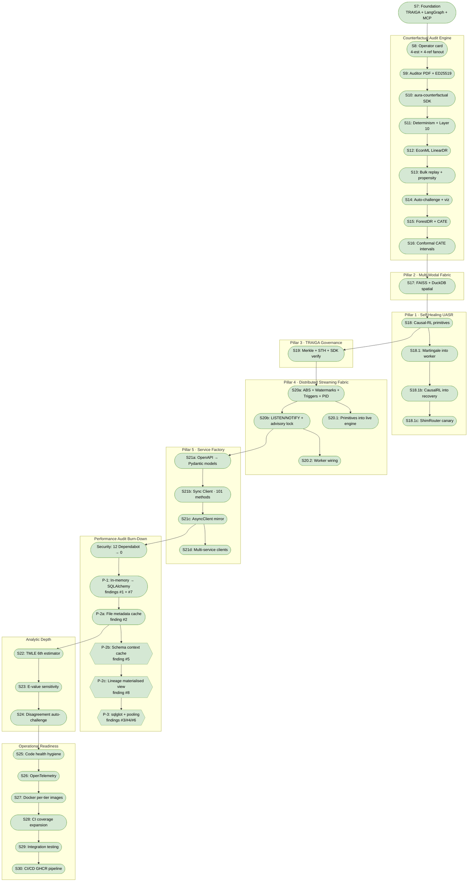

# AURA — Sprint Registry

The public sprint registry. **Both developers update this file** when
they ship a sprint, claim an in-flight one, or want to reserve an
upcoming one. Replaces the local-only `MEMORY.md` files each Claude
maintained pre-2026-05-19.

See `CLAUDE.md` for the sprint-numbering convention and commit style.

## Sprint flow + dependencies

**Legend**
- **🟢 Rounded** (`S7`, `S8`, `S17`, …) — shipped to `main` with CI green
- **🔵 Hexagon, blue** (none currently) — currently in flight on a feature branch
- **🟡 Hexagon, yellow** (none currently) — in the backlog, ready to start
- **⬜ Trapezoid, dashed** (none currently) — deferred or future

**Dependencies**
- **Solid arrow** — chronological order or hard prerequisite (e.g., S12 builds on S11's determinism contract)
- **Dashed arrow** — "this will wire into that later" (e.g., S18 primitives → S18.1 integration into the live MAPEK worker)

## Current status

All 5 enterprise pillars are feature-complete, and the **S34 AI-native
finance-auditor pivot is fully shipped** (S34a signed AS-1215 audit core,
S34b HITL exception queue with JWT-bound signed decisions, S34c ingestion
hardening, S34d egress PII tokenization). Security posture as of
2026-06-11: 0 open Dependabot alerts (Sec-5 pyarrow), CodeQL XSS #50-52
closed (Sec-6). The performance audit burn-down is COMPLETE — all 8
findings ✅ (see docs/AUDIT_BURN_DOWN.md; P-2b/P-2c/P-3 landed earlier
as `3a9d195`/`27c088b`/PR #17). S35 shipped the HITL frontend wiring;
Sec-7 (in flight, PR #75) closes the enterprise-deployment posture and
the ingestion masking tension. Enterprise readiness: see ENTERPRISE.md
→ Production Deployment Checklist; investor flow: docs/INVESTOR_DEMO.md.

## In flight (active)

| Sprint | Owner | Branch | Started | Goal |
|---|---|---|---|---|
| *(none — Rohith's PR #73 visual polish renumbered S36 to resolve the S35 collision; merging)* | | | | |

## Completed (newest first)

| Sprint | Bundle (+ hotfix) | Subsystem | What it ships |
|---|---|---|---|
| **S40** | PR #84, issue #83 | counterfactual_service + docs | **One-click forensic audit demo.** Wires the S39 forensic inputs (`goods_receipts`, `period_end`, approver fields, `historical_reports`) into a surface so the new findings actually show. New `GET /audit/financial/demo` audits a canned, deliberately fraud-laden dataset (`counterfactual_service/forensic_demo.py`) engineered to trip **every** technique in one run — AS-2401 Benford (59-entry first-digit violation) + duplicate + round-dollar + period-end cutoff; AS-2201 two-way + three-way match + segregation of duties + approval authority; AS-2305 absolute + expectation deviation — returning the same signed, independently-verifiable report as `/audit/financial`. Dataset is backend-owned (no collision with the in-flight S37 frontend overhaul; the Workbench can point its "run sample audit" at the endpoint whenever). INVESTOR_DEMO.md Act 3 rewritten to narrate the per-standard findings; 1 TDD case asserts all techniques fire. |
| **S39** | PR #82, issue #81 | agents + counterfactual_service + cleanup | **Forensic depth for the PCAOB financial auditor (v0.4.0) + dead-service removal.** The audit layer was the shallowest code on the deepest IP, and two docstrings overclaimed; this makes them true by implementing real forensic methods, each gated so the pre-S39 minimal-input tests stay green. **AS-2401:** Benford's-Law first-digit MAD test (Nigrini 0.015 nonconformity cutoff, gated ≥50 sample) + period-end cutoff/window-dressing test (gated on `posting_date`+`period_end`) — the latter was falsely claimed before. **AS-2201:** three-way match (PO↔invoice↔goods-receipt when receipts supplied) + authorization controls (segregation of duties, approval authority) — replaces the never-implemented "verifies approval signatures" claim. **AS-2305:** expectation-based analytics flagging deviation from an account's prior-period mean beyond performance materiality (uses `historical_reports`, previously ignored). `goods_receipts`+`period_end` threaded through `run_full_audit` and `/audit/financial` (optional, backward-compatible); 19-case TDD `tests/test_forensic_audit.py`. **Cleanup:** deleted dead `database/` (duplicate of connectors) and `knowledge_base/` (non-deployed, MCP-unexposed) services across the whole surface (dirs, SDK clients, codegen rows, `EXPECTED_CLIENTS`, pure-kb tests) — metadata_store vector-search coverage preserved in `test_metadata_store.py`. |
| **S36** | (PR #73, issue #72 — claimed as "S35" before the numbering collision with PR #71 was spotted; renumbered here) | frontend | **Audit-service visual polish, from driving the live UI.** S36a: 6 nav ids (library/dashboards/lineage/cost/webhooks/counterfactual) had no `NAV_ICON_MAP` entry → collapsed rail showed clipped text fragments; icons added in the house 18×18 stroke style, `NAV_ITEMS` extracted to `Layout/nav.ts` (importable by tests without tripping react-refresh), test pins every-item-has-icon (now also covers `audit-hitl` from PR #71, which gets a scales-of-justice icon in the merge). S36b: dashboard claimed "All services operational" off the gateway-only `/health` probe while the services card said 1/8 — new `healthHint()` says only what the probe measured ("Gateway healthy"). S36c: customer-facing `/audit/new` rendered a native unstyled file input and an invisible disabled Next (border-default fill on dark bg) — now a themed drag&drop zone (hidden input keeps `wizard-file-input` for programmatic uploads) and outlined disabled buttons. |
| **Sec-7** | squash-merge `3e5ff8f` (PR #75, issue #74) | deploy + ingestion_service + shared | **Enterprise deployment hardening.** (1) The Helm chart never set `ENVIRONMENT=production`/`AURA_AUTH_MODE` — the Sec-4 boot gates were unarmed on-cluster, i.e. a production deploy silently ran **open admin-token minting** with the default `SECRET_KEY`; values.yaml now pins production posture and documents the required `aura-secrets` keys (SECRET_KEY, GEMINI_API_KEY, AURA_SIGNING_PRIVATE_KEY_HEX, AURA_PII_TOKEN_KEY, DATABASE_URL). (2) ERP `/ingest/*` endpoints were unauthenticated ledger-injection — now bearer-gated 401 fail-closed. (3) **`PIIMaskingMiddleware` was a silent no-op**: `request._receive` mutation doesn't propagate through `BaseHTTPMiddleware.call_next` on current Starlette, so raw PII flowed to Kafka while the code claimed perimeter defense; rewritten as a pure ASGI `receive`-wrapper (content-length kept honest) and upgraded from `[REDACTED]` to keyed deterministic tokenization — resolves the S34d raw-in-boundary tension (AS-2401 correlation survives, raw PII never enters the stream). Plus ENTERPRISE.md "Production Deployment Checklist" (10-item, fail-closed) and `docs/INVESTOR_DEMO.md`. 5 Tier A tests; SDK-regen hotfix (auth deps add HTTPBearer to the ingestion schema). **Lesson: assert middleware effects end-to-end — an unasserted middleware can be a no-op for months.** |
| **S35** | squash-merge `4328f87` (PR #71, issue #70) | frontend | **HITL Audit Workbench wired end-to-end.** `ExceptionQueue.tsx` was an unrouted Tailwind mock with a `console.log` decision. Now: real page (`Audit Workbench` nav) in the design system driving run-sample-audit → signed report + live verify badge → PII-masked pending queue → mandatory-rationale approve/override → signed `HumanOverrideRecord` → queue refresh. **Bearer plumbing added to the ApiClient request wrapper** (the frontend previously sent no `Authorization` header anywhere, so every role-gated endpoint 401'd from the UI); `financialAuditService` with `ensureAuditorToken` (open-mode dev/demo JWT); all `record_hash`/`finding_id` URL segments pass the Sec-6 `sanitizeRecordHash` hex gate. 4 Vitest cases; verified against the live gateway (token → audit → 401 fail-closed → JWT-attributed decision → queue 6→5 → verify=true). |
| **S34d** | squash-merge `80774ad` (PR #67, issue #66) | shared + counterfactual_service | **Deterministic HMAC-keyed PII tokens at egress** — closes the S34 pivot. Same (tenant, field, value) → same `PII-<12hex>` token (`HMAC-SHA256(AURA_PII_TOKEN_KEY, tenant\|field\|value)`), so auditors correlate one employee across findings/reports/exception-queue without raw PII. HMAC not plain hash (names are dictionary-invertible unkeyed); **no key configured → falls back to `[REDACTED]`** (never emits unkeyed deterministic output); tenant- and field-salted (no cross-tenant/cross-field linkage). `client_view` + `exception_queue.pending_exceptions` switched to `mask_pii_egress`; signed artifacts keep raw evidence, hash basis unchanged; ingestion perimeter middleware untouched (raw-in-boundary tension documented in the spec). 7 Tier A tests. Spec: `docs/superpowers/specs/2026-06-11-s34d-pii-tokenization-design.md`. |
| **Sec-6** | squash-merge `e8c238e` (PR #65, issue #64) + hotfix (PR #69) | frontend | **Close CodeQL #50-52 (HIGH, `js/xss-through-dom`):** `audit_record_hash` from the remote job-status response fed three `<a href>`s in `Counterfactual.tsx` (PDF / artifact JSON / verify). New `sanitizeRecordHash` in `services/api.ts` cuts the response half of the taint path — 64-char lowercase sha256 hex only (same boundary rule as backend `exception_queue._index_path`), applied at `setRecordHash` so a non-conforming hash renders no links. **Hotfix (PR #69):** the alerts survived the first merge — the localStorage→`API_BASE_URL` half was guarded by a `new URL()`+protocol check that returns the tainted string unchanged, a pattern CodeQL does NOT model as a barrier (which is also why the alerts survived S31a's original `sanitizeApiBase`). Replaced with a regex `.test()` guard (recognized sanitizer): `scheme://host[:port][/path]`, no userinfo/query/fragment/whitespace. Lessons: multi-source taint paths need a barrier per source; a validator that round-trips its input is invisible to taint tracking — return-after-regex-test is the recognizable shape. |
| **S34a–c** | squash-merge `05dad88` (PR #61, issue #60) | counterfactual_service + ingestion_service + agents | **AI-native finance-auditor pivot — signed audit core, HITL queue, ingestion hardening.** S34a: `run_full_audit` composes AS-2110/2305/2201/2401; AS-1215 Engagement Completion Document with 100%-population `dataset_fingerprint`; persistent-ED25519 `sign_and_persist` (refuses revoked kids → `unsigned`); tamper-detecting `/audit/financial/verify`; egress-only PII `client_view` (signed artifact keeps raw evidence); gateway proxies; `ingestion_service` registered in the S21d SDK codegen (12th typed client). S34b: per-finding `finding_id` under the report signature; `exception_queue.py` — pending view + decisions as signed `HumanOverrideRecord` artifacts + WORM `audit_human_override` (409 on double-decision); decision identity bound to verified JWT sub via `_require_auditor` (Rohith's fail-closed hardening `7b721d8`). S34c: tolerant Kafka producer (`KafkaUnavailableError`; broker-down degrades publishes, never boot), `on_event`→lifespan, auditable `ingestion_publish_failed` WORM event, `tests_contract/` added to the base CI lane. 24 new Tier A tests. Specs/plans: `docs/superpowers/{specs,plans}/2026-06-10-s34{a,b,c}-*`. CI lessons: CI ruff is stricter than the CLAUDE.md pre-push command; SDK schemas must be regenerated on a CI-matched fastapi (ValidationError gained `ctx`/`input`). |
| **Sec-5** | squash-merge (PR #63, issue #62) | deps | **pyarrow `>=16.0,<19.0` → `>=23.0.1,<24`** in requirements.txt + pyproject.toml — closes the 2 HIGH Dependabot alerts (#34/#35: use-after-free reading IPC files with pre-buffering; patched 23.0.1). The old `<19` cap had no documented constraint and blocked the fix. Verified on 23.0.1: parquet roundtrip + file-service/upload suites green. |
| **S32** | squash-merge `00d828e` (PR #59) | agents | **DPC dual-paradigm SQL verification:** cross-checks `SQLGeneratorAgent` SQL against an independently-generated pandas solution to catch hallucinated SQL that passes EXPLAIN but answers the wrong question. New `agents/dpc_verifier.py`: extract single base table (CTE-aware via sqlglot) → materialize it bounded by `AURA_DPC_MAX_ROWS` → LLM writes ONE pandas expression → **AST-allowlisted sandbox eval** (only `df` + safe builtins; `pd`/`np` removed so `pd.read_pickle`/`read_sql` sinks are unreachable; no imports/lambdas/comprehensions or `__*`/`to_*`/`read_*`/`eval`/`query` attrs; `__builtins__` replaced; wall-clock timeout) → value-multiset compare. Tri-state verdict (`verified`/`mismatch`/`skipped`) on `result.output`; one bounded SQL retry on mismatch; whole pass bounded so a slow LLM never blocks the answer. Gated by `AURA_DPC_ENABLED` (default on; `0` is byte-identical). v1 scope: single-table + bounded-size (multi-table/oversized → honest skip). 43 Tier A + 2 Tier B real-LLM tests (the latter caught a wrong total live). Also modernized two order-fragile `test_agents.py` cases to `asyncio.run`. Spec/plan in `docs/superpowers/{specs,plans}/2026-05-31-dpc-sql-verification*`. Sandbox hardened in response to an automated HIGH finding on an earlier regex approach. |
| **S33** | squash-merge `b3ee28b` (PR #53) | counterfactual_service | **Significance-aware verdict (no overclaim):** pairs with Rohith's S31f (#50), which fixed only the web cert. The audit verdict was recomputed in three independent places; the two backend surfaces still judged on point magnitude alone, so the SIGNED, downloadable PDF asserted a directional effect (e.g. "decreased the outcome −0.024") even when every 95% CI straddled zero — and could contradict the web cert for the same signed hash. New `counterfactual_service/verdict.py` with ONE `significance_verdict()` (mirrors S31f + 0.02 material threshold; status empty/not_material/not_significant/detected; "detected" only when every estimator's 95% CI excludes zero; robust to dict-or-model estimates + string-serialized replay numbers). Both `pdf_renderer._verdict_text` and `renderers._headline` route through it; structured verdict also attached to the `rendered` block. `rendered` is excluded from the artifact hash basis → Layer-10 byte-identity preserved. 12 TDD tests. Frontend follow-up (Rohith): read `artifact.rendered.verdict.label` instead of recomputing. |
| **S30** | `ea83cdd` | shared | **CI/CD Pipeline (Build & Push to GHCR):** Created `.github/workflows/cd.yml` to automatically build and push Docker images to the GitHub Container Registry. Implemented a Docker Buildx matrix to concurrently build all three optimized tiers (`base-runtime`, `causal-runtime`, and `streaming-runtime`) from our new multi-stage `Dockerfile`. Configured dynamic metadata tagging so that pushes to `main` are automatically tagged as `latest`, and GitHub Releases are tagged with their respective Semantic Versioning numbers (`v1.x.y`). |
| **S29** | `ea83cdd` | shared | **Integration Testing (Schemathesis + Compose):** Added a new `contract-test` job to `ci.yml` that boots the API Gateway locally and uses `schemathesis` against the `/openapi.json` spec to ensure the running API strictly conforms to the advertised schema. Created `.github/workflows/nightly-e2e.yml` which runs on a cron schedule (`0 3 * * *`) to boot the entire microservice stack using `docker-compose up -d`, waits for health checks, and then runs a new E2E test suite (`tests_e2e/test_compose.py`) that pings every single service across the `localhost:8000-8009` port range using `httpx`. |
| **S28** | `ea83cdd` | shared | **CI Test Coverage Expansion:** Closed the coverage blind spots without bloating the base test lane time. Added a new `causal-test` CI job that installs `dowhy` and `econml`, specifically targeting `causal_service` and `counterfactual_service`. Added a new `streaming-test` CI job that installs `aiokafka`, specifically targeting the `uasr` and `pipeline` components. Removed redundant dowhy-gated test steps from the `eval-gate` job. All three testing lanes now successfully enforce the project's 60% base coverage threshold. |
| **S27** | `ea83cdd` | shared | **Docker Restructuring (per-tier images):** Decomposed the monolithic `aurabackend/Dockerfile` into an optimized multi-stage build emitting three distinct runtime tiers: `base-runtime` (slim API services), `causal-runtime` (+DoWhy/EconML), and `streaming-runtime` (+Kafka handlers). Separated `aiokafka` and `websockets` into a new `requirements-streaming.txt` to avoid installing heavy Kafka clients where not needed. Updated the `docker-compose.yml` build context so the shared anchor targets `base-runtime` while `uasr_service` explicitly overrides to target `streaming-runtime`. |
| **S26** | `ea83cdd` | shared | **Observability (OpenTelemetry):** Enabled out-of-the-box OpenTelemetry distributed tracing across all microservices. Added `opentelemetry-distro`, `opentelemetry-exporter-otlp`, and `opentelemetry-instrumentation-fastapi` to `requirements.txt`. Intercepted the shared `create_service()` factory to auto-instrument every API router, deliberately ignoring high-noise `/health` and `/metrics` routes. Added a local `jaeger` all-in-one collector to `docker-compose.yml` (exposing the UI on port 16686) and set the `AURA_OTLP_ENDPOINT` environment variable in the shared compose block. |
| **S25** | `ea83cdd` | many | **Code Health Hygiene:** Mass converted 316 frontend files from scattered 2-space to unified 4-space indentation for absolute consistency. Dropped unused `_legacy/` frontend components and `.bak` backups to reduce repository cruft. Fixed 15 unused/undefined variables (like `F841`) across Python services and patched 5 fragile test cases (`test_rate_limit.py`, `test_streaming.py`, `test_sprint7_smoke.py`) that were relying on dangling variable assignments. Wired `ruff check --fix` and `ruff format` directly into `.pre-commit-config.yaml` to permanently enforce the linting standard. |
| **S18.1c** | squash-merge `079da0c` (PR #28) | uasr | Wires S18 `shim_router` (Kramer-Magee canary routing) into `uasr/mapek_worker.py`, replacing the pause/resume pattern with traffic-splitting canary deploys. |
| **S18.1b** | squash-merge `4a7b862` (PR #27) | uasr | Wires S18 `CausalRLEvaluator` into `uasr/recovery_loop.py` for off-policy shim selection during MAPE-K recovery. |
| **S24 + Sec-4.1** | `fec3487` + hotfix `8d3b96f` → squash-merge `9cdc7ee` (PR #26) | counterfactual_service + shared/middleware | TMLE-vs-ForestDR disagreement auto-challenge: emits high-severity `AdversarialChallenge` when point estimates diverge by >2× the larger CI half-width. Same shape as S14's propensity warning. Sec-4.1: narrowed overbroad `except Exception` in `RateLimitMiddleware.__init__` to `(ImportError, AttributeError)`; exposed `SecurityHeadersMiddleware.apply_to()` + wired `_apply_security_headers` into both exception handlers so 4xx/5xx responses also get defensive headers. |
| **Sec-4** | `fa09e4f` + hotfix `5684044` + hotfix `9b7e114` → squash-merge `5ae3171` (PR #25) | shared (config + middleware + service_factory) + README + 3 test files | Five real findings from a Copilot audit triage (other findings either stale per Sec-3, wrong threat model for header-auth APIs, or maturity recommendations rather than vulnerabilities). (1) auth-mode prod gate — new `@field_validator` rejects `AURA_AUTH_MODE=open` when `ENVIRONMENT=production`, mirroring the existing SECRET_KEY validator. (2) CORS `http://` prod gate — promoted `warnings.warn` to `raise ValueError`, parallel to the existing wildcard `*` rejection. (3) X-Forwarded-For opt-in — new `AURA_TRUST_FORWARDED_FOR` env flag (default `False`); `RateLimitMiddleware._client_ip` honours XFF only when set, mitigating header-spoofed rate-limit bypass. (4) `SecurityHeadersMiddleware` (new) — sets `X-Content-Type-Options: nosniff` + `X-Frame-Options: DENY` + `Referrer-Policy: no-referrer` on every response; HSTS in production only (preserves http://localhost dev flow). (5) README signing-key example — replaced `("01" * 32)` with `python -c "import secrets; print(secrets.token_hex(32))"` + DON'T-USE-IN-PROD callout. Two hotfixes needed: (a) existing prod-mode test fixtures (`test_is_production_property`, `test_production_rejects_default_secret_key`, `test_cors_wildcard_rejected_in_production`) cascade-failed on the new validators because they instantiated `AuraSettings(env=production)` without overriding the default localhost CORS or default `auth_mode=open` — supplied explicit valid auth_mode + HTTPS CORS in every prod-mode fixture; (b) rewrote `test_x_forwarded_for_ignored_by_default` from a flaky TestClient route handler that instantiated a second `RateLimitMiddleware` inside the request (returned HTTP 422) to a pure unit test against a `SimpleNamespace` duck-typed Request — `-x` flag in CI made the single XFF failure cascade into the coverage gate too. Lesson: when adding any new production-mode validator on a Settings field, every existing prod-mode test fixture must be updated in the same PR to supply a complete valid config, otherwise CI cascades. |
| **Sec-3** | `489cdf4` → squash-merge `f842136` (PR #23) | api_gateway + database + counterfactual_service | Closes 4 new CodeQL alerts on `main`. (#49 HIGH `py/weak-sensitive-data-hashing`) drops `password` from `_pg_pool_key` dict — pool identity is (host, port, database, username); password adds no uniqueness. (#42 HIGH `py/sql-injection`) inline barrier-guard before `text(query)` in `connection_manager.execute_query`: string-prefix whitelist (SELECT/WITH/SHOW/DESCRIBE/DESC/EXPLAIN) + sqlglot AST deny-list (Drop/Delete/Insert/Update/Alter/Create/TruncateTable/Merge/Commit/Rollback) covering both top-level and nested statements. Same intraprocedural-sanitizer lesson as `feedback_codeql_path_injection_sanitizer`. (#24 MED `py/stack-trace-exposure`) bulk-verify endpoint strips exception to `type(exc).__name__`. (#18 MED) `etl.suggest_transforms` swaps `f"{e}"` for `sanitize_error()`. |
| **S23** | `a866784` + hotfix `3f73a91` → squash-merge `987b277` (PR #22) | counterfactual_service | E-value (VanderWeele-Ding 2017) + Cinelli-Hazlett 2020 robustness value attached to every `CounterfactualEstimate`. New `SensitivityReport` schema in hash basis → Layer 10 byte-identity extends to cover sensitivity drift. Pure NumPy + stdlib `sensitivity.py` with closed-form `compute_evalue` (Chinn 2000 continuous-outcome conversion `RR ≈ exp(0.91·|d|)` + `E = RR + sqrt(RR·(RR-1))`) and `compute_robustness_value` (`RV_q = 0.5·(sqrt(f⁴ + 4f²) - f²)` + 1x-benchmark extreme-scenario adjustment). Single `_attach_sensitivity` helper in `engine.run_estimators` post-fan-out — the eight existing estimator wrappers (LinearDR/ForestDR/TMLE/DoWhy×4) are byte-identical at the line level. Hotfix: relaxed one test from `adjusted == 0` (only triggered at pathological partial_r²→1) to `|adjusted| ≤ |point|` + sign-preservation invariants. SE backed out of CI under normal-sampling z=1.959964 (no scipy dep). Tier A contracts verified against `EValue` / `sensemakr` R packages: Darfur t=4.18,dof=783 → RV=0.139; d=0.5 → E=2.529. Layer 22 contract: strong-effect DGP RV=0.44 / E=5.41, null-effect DGP RV=0.028 / null_crossed=True. |
| **S20.1** | `4c529be` → squash-merge `9d3db43` (PR #18) | pipeline/streaming | Third and final deferred integration sprint — closes the arc S20.2 → S18.1 → **S20.1**. Wires all 5 S20a streaming primitives into the 3 live streaming modules in one bundled PR. `backpressure.py`: `BackpressureManager` gains `use_pid_control` + `PIDBackpressureController` lazy-init; new `compute_ingest_sleep_seconds(dt, max_sleep)` returns 0.0 in classical mode or `u(t)*max_sleep` in PID mode — ingest loop sleeps that long when buffer overshoots target (asymmetric clamp [0,1] — never speeds up ingest). `window_processor.py`: 4 new flags — composite `WatermarkTracker` (composite = min(per-upstream watermarks)), `WatermarkTrigger`/`TriggerContext` dispatch in `_fire_ready_windows`, parametric `late_data_policy_callable` (e.g. `remerge_within_allowed_lateness_policy`). `streaming_engine.py`: `BarrierAligner` lazy-constructed for snapshot-aligned checkpointing — `_inject_barrier` feeds every channel; checkpoint fires only when `AlignmentEvent.ALIGNED` (Chandy-Lamport exactly-once). Threads all flags through `__init__`. Every flag defaults OFF — 64 pre-S20.1 streaming tests still pass byte-identical. 16 new contract tests in `test_streaming_s20_1_integration.py` pin each opt-in path. CodeQL: 0 new alerts. Deferred follow-ups: S18.1b (CausalRLEvaluator into recovery loop), S18.1c (Kramer-Magee ShimRouter replacing pause/resume). |
| **P-3** | PR #17 | api_gateway + safety | sqlglot AST validator + connection pooling. Closes audit findings #3, #4, #6. `_estimate_query_cost` + `_check_performance_ast` use AST node counts; `QueryPlanner` join multiplier linearised; asyncpg pool registry replaces per-request connect/disconnect. 973 tests pass. |
| **P-2c** | `27c088b` | api_gateway | Lineage materialised view resolves audit #8. `gateway_lineage_edges` cache populated at create-time; `GET /lineage` is now two indexed SELECTs; FK CASCADE prunes on delete. |
| **P-2b** | `3a9d195` | api_gateway | Schema context cache resolves audit #5. `gateway_schema_context` table keyed by SHA-256 fingerprint; populate-on-upload + 60s refresh; queries.py switches to use_llm=False inline. |
| **Sec-2** | `39d8d58` + fix-ups `ad7e0f3` + `0194486` + `801b673` → squash-merge `4161ccc` (PR #16) | shared + api_gateway + database + counterfactual_service + evolution + .github | Closes all 42 open CodeQL alerts + 1 github-code-quality bot lint comment on PR #15. Four fix clusters: (a) `SQLSafetyValidator` wired into `connection_manager.execute_query` (HIGH alert #42, defense-in-depth); (b) new `shared/safe_paths.py` + inline `realpath + startswith + trailing-sep` sanitizer at FileResponse sinks in `etl.py`/`pipelines.py` (HIGH alerts #36-#41); (c) new `shared/error_handler.py::sanitize_error` helper + 25 callsite replacements removing `str(exc)`-into-response leaks (MEDIUM alerts #11-#35); (d) workflow-level `permissions: contents: read` block in `.github/workflows/ci.yml` (MEDIUM alerts #1-#10). Three fix-up commits needed to find the CodeQL-recognised sanitizer pattern: `Path.relative_to` (not modelled), then `commonpath` w/ intermediate variable (not modelled), then canonical `realpath + startswith(base + os.sep)` form (recognised). 20 contract tests in `test_sec2_helpers.py` pin the boundary attacks. |
| **S18.1** | `cae03b2` → squash-merge `5026ce0` (PR #15) | uasr | Wires S18 `WassersteinMartingaleDetector` into live `mapek_worker._analyze_detect_drift`. 4 new `MAPEKConfig` flags (default OFF for backwards-compat); `__init__` lazy-constructs the detector only when opted in. Dispatch tries martingale first → falls through to classical IQR on no-alarm / no-baseline (never silently drops a drift signal). DriftDetectionResult shape preserved across paths so recovery loop + audit log + frontend operator card need zero changes. Severity escalation flag (`martingale_alarm_severity_high`) lets operators bypass `pause_on_severity` gating per source. 9 contract tests pinning the Azuma-Hoeffding bound (≤ 3 false-positives in 30 batches at α=0.05) + 3σ drift detection within 20 batches. Bundle scope: detector swap only — Causal-RL shim selection (S18.1b) and Kramer-Magee canary router replacing pause/resume (S18.1c) deferred. Second of three deferred integration sprints. |
| **S20.2** | `bfb31fa` + hotfixes `4b0279e` + `5ce3b38` → squash-merge `fbe5556` (PR #14) | scheduler_service | Wires S20b distributed primitives into live scheduler worker. Auto-detects Postgres → LISTEN/NOTIFY wake + pg_advisory_lock cron-evaluator leader election; SQLite → pure polling fallback (backward-compat unchanged). `scheduler.replicas > 1` finally unblocked. p99 job-start latency drops from 60s (polling) to sub-second (NOTIFY hop). Two hotfixes needed for tz-naive vs tz-aware datetime mismatch: SQLite stores datetimes as strings and is forgiving; Postgres+asyncpg is strict and rejected tz-aware parameters against tz-naive columns. Fix: `.replace(tzinfo=None)` in worker.\_evaluate\_and\_execute + every model `default=` lambda. Lesson: when a Postgres schema uses tz-naive columns, EVERY producer of values (worker reads, model defaults, test fixtures) must strip tzinfo. CI lane runs both test_scheduler_distributed.py (S20b) and test_scheduler_worker_integration.py (S20.2) against postgres:16. |
| **S21d** | `1e3c929` + hotfix `a52c3af` → squash-merge `817b75e` (PR #13) | scripts + sdk_clients + 11 service openapi.json | Multi-service SDK codegen — 11 typed clients (causal, code_generation, connectors, dar, database, execution_sandbox, gateway, insights, knowledge_base, metadata_store, orchestration, scheduler) auto-generated from each service's OpenAPI schema. 162 typed methods total. `scripts/regen_all_sdks.py` orchestrator with subprocess-per-service isolation. CI lane regenerates + diffs schemas AND clients. Pillar 5 vision complete. |
| **S22** | `07794d2` + hotfix `e3d4d2a` → squash-merge `f76db51` (PR #12) | counterfactual_service | Cross-fitted TMLE as 6th estimator slot. Pure NumPy + sklearn (no econml). Closed-form ε targeting via van der Laan & Rubin 2006 identity-link linear submodel; influence-curve CI from the efficient gradient. Layer 19 contract proven: TRUE_EFFECT recovered within MAE ~0.01 on synthetic DGP (target was MAE 0.20). 16 contract tests gated on `pytest.importorskip("sklearn")` so the eval-gate lane runs them via the `test_counterfactual_*.py` glob. First sprint shipped under the two-developer protocol via feature branch + PR. |
| **P-2a** | `ab25f71` | api_gateway | File metadata cache resolves audit #2. `gateway_file_metadata` table + populate-on-upload + 60s background refresh; `/dashboard/stats` becomes a single SELECT. ~100-1000× p99 dashboard-latency improvement. |
| **P-1** | `5a03f16` + `9ffd91c` | api_gateway | Migrated `_query_history_store + _saved_queries_store + _share_tokens_store` to SQLAlchemy. Resolves audit #1 + #7. **Lazy-init via `session_scope()`** is the test-friendly pattern; don't break it. |
| **Security** | `5ccaa15` | frontend | 12 Dependabot alerts → 0. axios `^1.16.1` + `overrides` block for 9 transitive deps. |
| **S21c** | `725c562` | sdk_clients | AsyncClient mirror — `async def` methods, `__aenter__/__aexit__`, asyncio.sleep in retry loop. Both Client and AsyncClient share APIError hierarchy. |
| **S21b** | `b1b532a` | sdk_clients | Typed sync Client with 101 methods (one per OpenAPI operation). Type narrows on `$ref` responses; falls back to `Dict[str, Any]` for the 93/101 untyped. |
| **S21a** | `aaa1f99` + `f63017f` | scripts + sdk_clients | OpenAPI 3 → Pydantic v2 codegen. 47 models from gateway openapi.json. New CI lane `SDK Codegen Sync` runs `git diff --exit-code` after regen. |
| **S20b** | `00bf93e` + `aa4c111` | scheduler_service | Distributed scheduler primitives: `compute_lock_id`, `NotifyPayload`, `ExponentialBackoff`, `AdvisoryLockHolder`, `DistributedQueue`. Dedicated postgres CI lane caught a `NOTIFY $1` parameter-binding bug pre-merge. |
| **S20a** | `19859bf` | pipeline/streaming | 5 streaming primitives — Carbone ABS `BarrierAligner`, Akidau composite-watermark `WatermarkTracker`, Dataflow triggers, late-data policies, Hellerstein-Diao PID. 56 contract tests; existing streaming engine UNTOUCHED. |
| **S19** | `61f8711` + `98d2c7e` | shared + counterfactual_service + sdk | TRAIGA federation: RFC 6962 Merkle audit log + Signed Tree Head + cross-org-verifiable inclusion proofs. SDK `verify_inclusion` anchors recomputed root against STH (not proof's self-attested root). |
| **S18** | `eae19e9` | uasr | Causal-RL primitives: Wasserstein-Martingale drift detector (Bifet-Gavalda + Azuma-Hoeffding), Kramer-Magee `shim_router` (no pause/resume), DR-Learner shim evaluator with TRAIGA-shaped audit artifact. |
| **S17** | `1532518` + `53dcc38` + `20c4c25` | connectors | Multi-Modal Fabric — FAISS in-process vector connector + DuckDB spatial extension. `requirements-multimodal.txt` for opt-in faiss-cpu. |
| **S16** | `12b8669` | counterfactual_service | Conformal CATE intervals (Vovk-Petej + Tibshirani-Barber). Layer 13 distribution-free coverage guarantee. |
| **S15** | `16a2845` + `0df609f` | counterfactual_service | ForestDRLearner + CATE quantile histogram. Wager-Athey honest forest with `CalibratedClassifierCV(GBC)` propensity. |
| **S14** | `06f8428` | counterfactual_service | Propensity auto-challenge + operator card visualisation (sensitivity bands + propensity quantile bars). |
| **S13** | `8a4f0b6` + `95982ed` | counterfactual_service + sdk | Bulk replay (NDJSON streaming) + propensity diagnostics in hash basis + verify endpoint shared `strip_for_hashing`. |
| **S12** | `905177f` | counterfactual_service | Real EconML LinearDRLearner replaces stub. Eval-gate de-skip: eval-gate lane now globs `test_counterfactual_*.py`. |
| **S11** | `e83865e` + `c27edcb` | counterfactual_service | Engine determinism: per-method `seed_for(request_hash, name)` + sequential fan-out. Layer 10 byte-identical replay. |
| **S10** | `0a1edc2` | sdk | aura-counterfactual Python package — sync + async clients, click CLI, Jupyter rich-repr. |
| **S9** | `81732c3` | counterfactual_service | Auditor PDF + replay endpoint + ED25519 signing. Layer 10 contract. |
| **S8** | `ba4a6f3` | counterfactual_service | Operator chat card with debate toggle + adversarial critic + 4-estimator/4-refuter fan-out. |
| **S7** | `f2976e6` | many | TRAIGA audit log, BATS/BAVT budgets, LangGraph orchestrator, MCP server. The foundation. |

S1-S6 pre-dated this registry; see commit `157b293` and earlier for that history.

## Backlog (next 5 in priority order)

| Sprint | Pillar | Owner | Description |
|---|---|---|---|
| ~~**P-2b**~~ | ~~Audit~~ | ~~Collaborator~~ | ~~Schema context cache — DONE, see `3a9d195`~~ |
| ~~**P-2c**~~ | ~~Audit~~ | ~~Collaborator~~ | ~~Lineage materialised view — DONE, see PR #17~~ |
| ~~**P-3**~~ | ~~Audit~~ | ~~Collaborator~~ | ~~sqlglot AST validator + connection pooling — DONE, see PR #17~~ |
| ~~**S23**~~ | ~~Analytic depth~~ | ~~Mouni~~ | ~~E-value sensitivity + Cinelli-Hazlett robustness — DONE, see PR #22~~ |
| ~~**S24**~~ | ~~Analytic depth~~ | ~~Mouni~~ | ~~TMLE-vs-ForestDR disagreement auto-challenge — DONE, see PR #26~~ |
| ~~**S25**~~ | ~~Ops~~ | ~~Mouni~~ | ~~Code Health Hygiene (Lint, unused vars, frontend cruft)~~ |
| ~~**S26**~~ | ~~Ops~~ | ~~Mouni~~ | ~~Observability (OpenTelemetry)~~ |
| ~~**S27**~~ | ~~Ops~~ | ~~Mouni~~ | ~~Docker Restructuring (per-tier images)~~ |
| ~~**S28**~~ | ~~Ops~~ | ~~Mouni~~ | ~~CI Test Coverage Expansion (Causal/Streaming lanes)~~ |
| ~~**S29**~~ | ~~Ops~~ | ~~Mouni~~ | ~~Integration Testing (Schemathesis + Compose)~~ |
| ~~**S30**~~ | ~~Ops~~ | ~~Mouni~~ | ~~CI/CD Pipeline (Build & Push to GHCR)~~ |
| **S31a** | YC Demo — Service Front Door | **Rohith** · claimed 2026-05-30 · **SHIPPED** (PR #40, merged 2026-05-31; CI green incl. CodeQL) | Frontend pivot: reposition AURA as an AI-native audit service (not a tool). Public front door (hero + scenario grid), live estimator-checklist progress view, formal Audit Certificate page (hash + ED25519 badge + PDF download), public `/verify/{hash}` page, custom-audit wizard (replaces raw JSON editor). Adds `react-router-dom`; existing dashboard moves under `/app/*`. Branch: `feature/s31a-service-frontend`. Spec: `docs/superpowers/specs/2026-05-30-s31a-service-frontend-design.md`. Plan: `docs/superpowers/plans/2026-05-30-s31a-service-frontend.md` |
| **S31b** | YC Demo — Audit Engine & Data | **Mounith** · claimed 2026-05-30 · status: spec landed, building MVP | Backend pivot: pre-loaded compliance demo dataset + scenario, persistent ED25519 signing key (non-ephemeral), IV estimator as 7th slot (S31 analytic depth), PDF report polish, single `/demo` endpoint that runs the full audit on pre-loaded data. Branch: `feature/s31b-audit-engine`. Spec: `docs/superpowers/specs/2026-05-29-s31b-audit-engine-design.md` |

**⚡ Action needed — claim your track:**
- Update the Owner column above with your name + today's date
- Open a GitHub issue titled `Sprint S31a: YC Demo Service Frontend` or `Sprint S31b: YC Demo Audit Engine`
- Push to the branch named above

The two tracks touch completely different subsystems (S31a = frontend only, S31b = backend + data) — no merge conflicts expected. Merge both to `main` independently as separate PRs.

Deferred indefinitely:
- **S20.2.1** — schema migration to move `ScheduledJob.next_execution_time` (+ other DateTime columns) to `DateTime(timezone=True)` so the `.replace(tzinfo=None)` dance can be dropped.
- **S21e** — roll the api_gateway client into `regen_all_sdks.py` (currently kept on its own pipeline for historical reasons).

## How to update this file

When you start a sprint:
1. Add a row to **In flight** with your handle + branch name + date.
2. Open a GitHub issue titled `Sprint <id>: <one-line goal>` and self-assign.

When you ship a sprint:
1. Move the row from **In flight** to **Completed** (newest first).
2. Add the commit SHA (+ hotfix SHA if any).
3. Summarise what shipped in one line.

When you reserve a future sprint:
- Add a row to **Backlog** with proposed owner — `TBD` if not claimed.

Update the date at the bottom when you make a material change.

Last updated 2026-05-31 — S31a SHIPPED (Rohith, PR #40): service-facing frontend pivot — public front door + scenario grid, live estimator-checklist progress, formal ED25519 certificate, public `/verify/{hash}`, custom-audit wizard; adds `react-router-dom` with the dashboard under `/app/*`. CI green incl. CodeQL (`js/xss-through-dom` sink hardened). S31b/S31c (Mounith) also shipped: audit engine, demo scenarios #1–4, and `POST /audit` ("audit your own data", #42). Next FE follow-up: wire the wizard to `POST /audit` (needs a file-upload step + `instrument` field) — own sprint.
