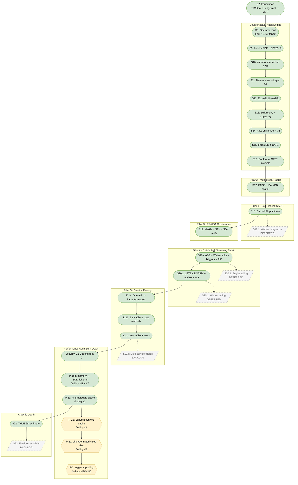
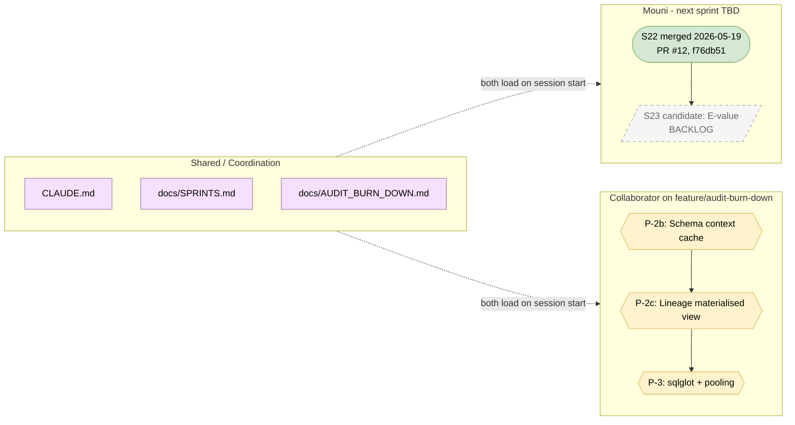

# AURA — Sprint Registry

The public sprint registry. **Both developers update this file** when
they ship a sprint, claim an in-flight one, or want to reserve an
upcoming one. Replaces the local-only `MEMORY.md` files each Claude
maintained pre-2026-05-19.

See `CLAUDE.md` for the sprint-numbering convention and commit style.

## Sprint flow + dependencies

**Legend**
- **🟢 Rounded** (`S7`, `S8`, `S17`, …) — shipped to `main` with CI green
- **🔵 Hexagon, blue** (`S22`) — currently in flight on a feature branch
- **🟡 Hexagon, yellow** (`P-2b/c`, `P-3`) — in the backlog, ready to start
- **⬜ Trapezoid, dashed** (`S18.1`, `S20.1/2`, `S21d`, `S23`) — deferred or future

**Dependencies**
- **Solid arrow** — chronological order or hard prerequisite (e.g., S12 builds on S11's determinism contract)
- **Dashed arrow** — "this will wire into that later" (e.g., S18 primitives → S18.1 integration into the live MAPEK worker)

## Current parallel tracks

The two tracks touched different subsystems (Mouni: `counterfactual_service/`; collaborator: `api_gateway/` + `safety/`) so merge conflicts were avoided. PRs land independently into `main`.

## In flight (active)

| Sprint | Owner | Branch | Started | Goal |
|---|---|---|---|---|
| **Audit burn-down (P-2b → P-3)** | Collaborator | `feature/audit-burn-down` (TBD) | 2026-05-19 | Close audit findings #3, #4, #5, #6, #8 — see `AUDIT_BURN_DOWN.md` |

Mouni's S22 track merged 2026-05-19 as PR #12 (`f76db51`).
Collaborator's audit-burn-down track is the only active feature
branch. No merge conflicts expected when their PR lands —
non-overlapping subsystems.

## Completed (newest first)

| Sprint | Bundle (+ hotfix) | Subsystem | What it ships |
|---|---|---|---|
| **S22** | `07794d2` + hotfix `e3d4d2a` → squash-merge `f76db51` (PR #12) | counterfactual_service | Cross-fitted TMLE as 6th estimator slot. Pure NumPy + sklearn (no econml). Closed-form ε targeting via van der Laan & Rubin 2006 identity-link linear submodel; influence-curve CI from the efficient gradient. Layer 19 contract proven: TRUE_EFFECT recovered within MAE ~0.01 on synthetic DGP (target was MAE 0.20). 16 contract tests gated on `pytest.importorskip("sklearn")` so the eval-gate lane runs them via the `test_counterfactual_*.py` glob. First sprint shipped under the two-developer protocol via feature branch + PR. |
| **P-2a** | `ab25f71` | api_gateway | File metadata cache resolves audit #2. `gateway_file_metadata` table + populate-on-upload + 60s background refresh; `/dashboard/stats` becomes a single SELECT. ~100-1000× p99 dashboard-latency improvement. |
| **P-1** | `5a03f16` + `9ffd91c` | api_gateway | Migrated `_query_history_store + _saved_queries_store + _share_tokens_store` to SQLAlchemy. Resolves audit #1 + #7. **Lazy-init via `session_scope()`** is the test-friendly pattern; don't break it. |
| **Security** | `5ccaa15` | frontend | 12 Dependabot alerts → 0. axios `^1.16.1` + `overrides` block for 9 transitive deps. |
| **S21c** | `725c562` | sdk_clients | AsyncClient mirror — `async def` methods, `__aenter__/__aexit__`, asyncio.sleep in retry loop. Both Client and AsyncClient share APIError hierarchy. |
| **S21b** | `b1b532a` | sdk_clients | Typed sync Client with 101 methods (one per OpenAPI operation). Type narrows on `$ref` responses; falls back to `Dict[str, Any]` for the 93/101 untyped. |
| **S21a** | `aaa1f99` + `f63017f` | scripts + sdk_clients | OpenAPI 3 → Pydantic v2 codegen. 47 models from gateway openapi.json. New CI lane `SDK Codegen Sync` runs `git diff --exit-code` after regen. |
| **S20b** | `00bf93e` + `aa4c111` | scheduler_service | Distributed scheduler primitives: `compute_lock_id`, `NotifyPayload`, `ExponentialBackoff`, `AdvisoryLockHolder`, `DistributedQueue`. Dedicated postgres CI lane caught a `NOTIFY $1` parameter-binding bug pre-merge. |
| **S20a** | `19859bf` | pipeline/streaming | 5 streaming primitives — Carbone ABS `BarrierAligner`, Akidau composite-watermark `WatermarkTracker`, Dataflow triggers, late-data policies, Hellerstein-Diao PID. 56 contract tests; existing streaming engine UNTOUCHED. |
| **S19** | `61f8711` + `98d2c7e` | shared + counterfactual_service + sdk | TRAIGA federation: RFC 6962 Merkle audit log + Signed Tree Head + cross-org-verifiable inclusion proofs. SDK `verify_inclusion` anchors recomputed root against STH (not proof's self-attested root). |
| **S18** | `eae19e9` | uasr | Causal-RL primitives: Wasserstein-Martingale drift detector (Bifet-Gavalda + Azuma-Hoeffding), Kramer-Magee `shim_router` (no pause/resume), DR-Learner shim evaluator with TRAIGA-shaped audit artifact. |
| **S17** | `1532518` + `53dcc38` + `20c4c25` | connectors | Multi-Modal Fabric — FAISS in-process vector connector + DuckDB spatial extension. `requirements-multimodal.txt` for opt-in faiss-cpu. |
| **S16** | `12b8669` | counterfactual_service | Conformal CATE intervals (Vovk-Petej + Tibshirani-Barber). Layer 13 distribution-free coverage guarantee. |
| **S15** | `16a2845` + `0df609f` | counterfactual_service | ForestDRLearner + CATE quantile histogram. Wager-Athey honest forest with `CalibratedClassifierCV(GBC)` propensity. |
| **S14** | `06f8428` | counterfactual_service | Propensity auto-challenge + operator card visualisation (sensitivity bands + propensity quantile bars). |
| **S13** | `8a4f0b6` + `95982ed` | counterfactual_service + sdk | Bulk replay (NDJSON streaming) + propensity diagnostics in hash basis + verify endpoint shared `strip_for_hashing`. |
| **S12** | `905177f` | counterfactual_service | Real EconML LinearDRLearner replaces stub. Eval-gate de-skip: eval-gate lane now globs `test_counterfactual_*.py`. |
| **S11** | `e83865e` + `c27edcb` | counterfactual_service | Engine determinism: per-method `seed_for(request_hash, name)` + sequential fan-out. Layer 10 byte-identical replay. |
| **S10** | `0a1edc2` | sdk | aura-counterfactual Python package — sync + async clients, click CLI, Jupyter rich-repr. |
| **S9** | `81732c3` | counterfactual_service | Auditor PDF + replay endpoint + ED25519 signing. Layer 10 contract. |
| **S8** | `ba4a6f3` | counterfactual_service | Operator chat card with debate toggle + adversarial critic + 4-estimator/4-refuter fan-out. |
| **S7** | `f2976e6` | many | TRAIGA audit log, BATS/BAVT budgets, LangGraph orchestrator, MCP server. The foundation. |

S1-S6 pre-dated this registry; see commit `157b293` and earlier for that history.

## Backlog (next 5 in priority order)

| Sprint | Pillar | Owner | Description |
|---|---|---|---|
| **P-2b** | Audit | Collaborator | Schema context cache — audit finding #5. Move `build_schema_context_cached` off the event loop OR pre-compute on upload. |
| **P-2c** | Audit | Collaborator | Lineage materialised view — audit finding #8. Per-workspace lineage graph derived from `gateway_saved_queries` + `gateway_dashboards`, refreshed on writes. |
| **P-3** | Audit | Collaborator | sqlglot AST replaces regex query validator + naive cost estimator — audit findings #3 + #4 + #6 (connection pooling can ride along). |
| **S23** | Analytic depth | TBD | E-value sensitivity + Cinelli-Hazlett robustness analysis. |

Deferred indefinitely:
- **S18.1** — wire S18 causal-RL primitives into `uasr/mapek_worker.py` live path.
- **S20.1** — wire S20a streaming primitives into `streaming_engine.py + window_processor.py + backpressure.py`.
- **S20.2** — wire S20b distributed_queue + advisory locks into `scheduler_service/worker.py`.
- **S21d** — auto-generate clients for additional services beyond api_gateway.

## How to update this file

When you start a sprint:
1. Add a row to **In flight** with your handle + branch name + date.
2. Open a GitHub issue titled `Sprint <id>: <one-line goal>` and self-assign.

When you ship a sprint:
1. Move the row from **In flight** to **Completed** (newest first).
2. Add the commit SHA (+ hotfix SHA if any).
3. Summarise what shipped in one line.

When you reserve a future sprint:
- Add a row to **Backlog** with proposed owner — `TBD` if not claimed.

Update the date at the bottom when you make a material change.

Last updated 2026-05-19 — two-dev coordination protocol established.
