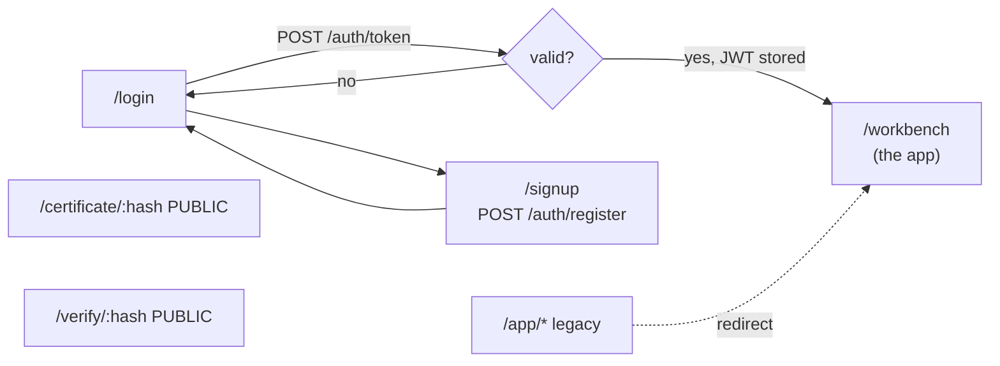
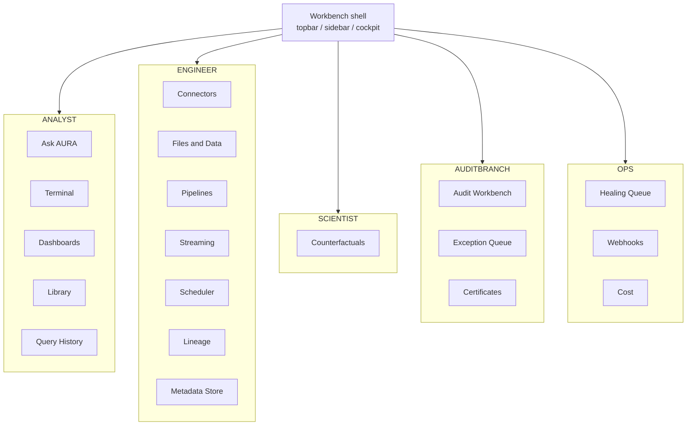
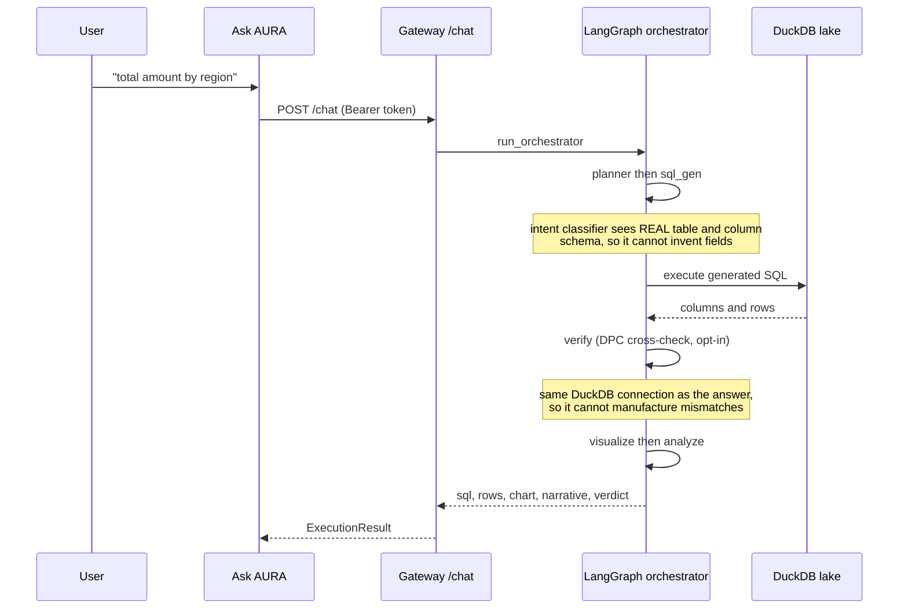
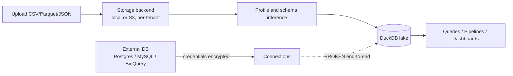
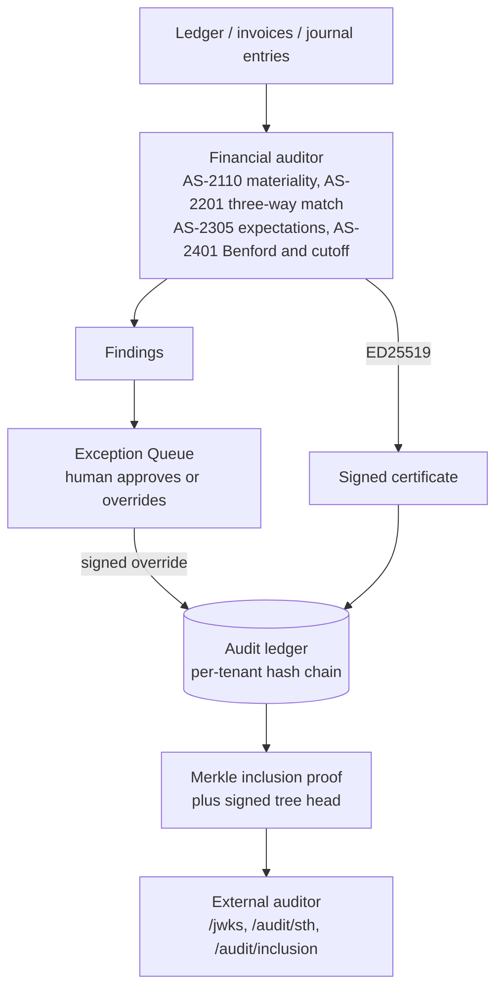
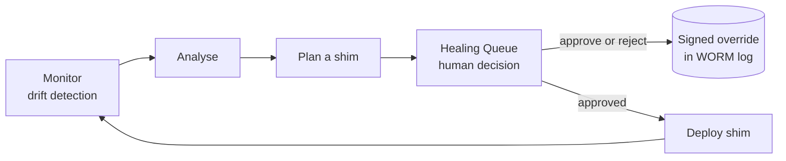

# AURA — App Wireflow

How a user actually moves through the product, and what happens behind each screen.
Renders as diagrams on GitHub.

---

## 1. Entry and authentication

`/certificate/:hash` and `/verify/:hash` are **public** — an external auditor opens them without
an AURA account. Everything else sits behind `ProtectedRoute`.

---

## 2. The workbench — one shell, many panels

Nav label to component mapping lives in `frontend/src/workbench/viewRegistry.ts`.
Every entry resolves to a real panel; there are no stubs left in the sidebar.

---

## 3. The core loop — a question becomes an answer

This is the product's primary path.

**Verified:** a `GROUP BY` was computed independently in Python from the raw CSV and matched
AURA's answer exactly.

---

## 4. Data in — the engineer path

The dashed edge is the **known gap**: the gateway stores connections, but the connectors service
reads a different store that nothing writes to. See `STATUS.md`.

---

## 5. The audit branch — how a claim becomes evidence

The right-hand path is what makes the claim checkable **without trusting AURA's server**.

---

## 6. Keeping evidence valid under change

Repairs are **never silent**. An automatic fix that changes model behaviour is itself an
auditable decision, so it needs a human owner and a signed record.

---

## Where things live

| Layer | Path |
|---|---|
| App shell and panels | `frontend/src/workbench/` |
| Nav to view mapping | `frontend/src/workbench/viewRegistry.ts` |
| API client | `frontend/src/services/api.ts` |
| Gateway routes | `aurabackend/api_gateway/routers/` |
| Agent DAG | `aurabackend/agents/langgraph_orchestrator.py` |
| Causal engine | `aurabackend/counterfactual_service/` |
| Ledger and signing | `aurabackend/shared/audit_ledger.py`, `counterfactual_service/signing.py` |
| Self-healing | `aurabackend/uasr/` |
